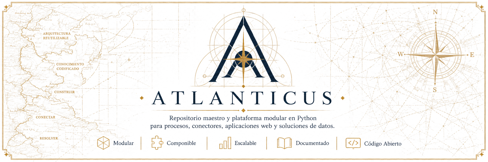

<p align="center">
  
</p>

# Atlanticus

Atlanticus es una **plataforma modular interna de software en Python** para construir procesos,
conectores, aplicaciones web y soluciones de datos a partir de capacidades reutilizables.

| Referencia | Valor |
|---|---|
| Versión del documento | `1.2.0` |
| Lenguaje base | Python `3.14.2` |
| Gestión de proyectos y dependencias | `uv` |
| Distribución de paquetes | Wheels de Python |
| Alcance | Uso corporativo interno |

## Qué es Atlanticus

Atlanticus no es una aplicación única ni una colección informal de código compartido. Es una
plataforma que reúne contratos, librerías versionadas, adaptadores de infraestructura, runtimes,
capacidades de dominio y herramientas de construcción, ejecución y distribución.

Su propósito es proporcionar una base común para que una solución nueva pueda concentrarse en su
problema real y reutilizar capacidades ya resueltas, como:

- configuración y secretos;
- serialización y persistencia de estado;
- observabilidad y telemetría;
- acceso a servicios, protocolos e infraestructura;
- definición y materialización de datasets;
- integración con fuentes especializadas;
- ejecución controlada de procesos;
- construcción de wheels y artifacts transportables;
- desarrollo de aplicaciones web sobre una estructura transversal;
- preparación de entregas para otros equipos técnicos.

### ¿Es una librería, un framework o una plataforma?

La clasificación principal de Atlanticus es **plataforma modular de software**.

| Clasificación | ¿Aplica? | Explicación |
|---|---:|---|
| Conjunto de librerías | Parcialmente | Contiene múltiples wheels reutilizables y versionados de forma independiente. |
| Framework | Parcialmente | El runtime de procesos y la base web establecen ciclos de vida y convenciones de ejecución. |
| Plataforma modular | Sí | Integra librerías, contratos, runtimes, herramientas, artifacts y distribución bajo una arquitectura común. |
| Aplicación final | No | Las aplicaciones y soluciones concretas se construyen sobre Atlanticus. |

Llamarlo solamente *framework* dejaría fuera sus capacidades de conectividad, empaquetado,
distribución y composición. Llamarlo solamente conjunto de librerías tampoco representaría los
contratos y flujos que permiten utilizarlas de manera coherente.

## Origen e historia del nombre

El nombre se inspira en el *Codex Atlanticus*, la mayor colección conservada de escritos y dibujos
de Leonardo da Vinci. Sus páginas reúnen estudios, diseños, mecanismos y observaciones de áreas
distintas: no describen una única máquina terminada, sino conocimiento que puede interpretarse,
relacionarse y reutilizarse para construir nuevas soluciones. La referencia histórica puede
consultarse en la [Veneranda Biblioteca Ambrosiana](https://www.ambrosiana.it/en/discover/masterpieces/codex-atlanticus/).

Atlanticus adopta esa idea como metáfora de ingeniería. Cada contrato, librería, conector, runtime
o capacidad de dominio funciona como una pieza de conocimiento técnico delimitada. Ninguna pieza
pretende resolver por sí sola una operación completa; su valor aparece cuando se combina con otras
mediante dependencias explícitas y responsabilidades claras.

La identidad del proyecto se resume en cuatro acciones:

1. **Construir:** crear capacidades pequeñas con responsabilidades identificables.
2. **Conectar:** integrar servicios y fuentes sin trasladar sus detalles al dominio consumidor.
3. **Resolver:** componer capacidades para responder a necesidades concretas.
4. **Impulsar:** reutilizar lo construido para reducir el esfuerzo de las siguientes soluciones.

## Por qué se construyó

Los procesos de datos y las aplicaciones operacionales suelen repetir necesidades transversales:
leer configuración, resolver secretos, acceder a infraestructura, registrar telemetría, controlar
tiempos de ejecución, materializar resultados, administrar estado y preparar una entrega
ejecutable.

Cuando cada proceso implementa esas responsabilidades por separado, aparecen soluciones
incompatibles, errores repetidos y acoplamiento entre el negocio y la infraestructura. Atlanticus
separa esas responsabilidades para que:

- las capacidades genéricas no dependan de una solución particular;
- los contratos se definan antes que sus consumidores;
- cada módulo tenga una responsabilidad y evolución identificables;
- los procesos complejos se construyan mediante composición;
- backend y web puedan evolucionar con límites claros;
- el código fuente, los artifacts y las distribuciones representen contextos distintos;
- una mejora transversal pueda beneficiar a más de una solución.

La finalidad no es ocultar la complejidad real del dominio. Es evitar que cada equipo deba volver a
implementar toda la complejidad técnica antes de comenzar a resolverlo.

## Cómo se construye una solución

Una solución utiliza únicamente los módulos que necesita. Un proceso de datos completo puede
formarse mediante la siguiente composición:

| Etapa | Responsabilidad | Área habitual |
|---|---|---|
| Contrato | Define identidades, entradas, salidas y reglas neutrales. | `backend/` o `integrations/` |
| Conectividad | Se comunica con servicios externos sin incorporar decisiones de negocio. | `connectivity/` |
| Productor | Traduce una fuente concreta a una capacidad reutilizable de adquisición. | `scopes/data-producers/` |
| Dominio | Aplica reglas pertenecientes a una solución o contexto específico. | `scopes/<solución>/` |
| Runtime | Controla el ciclo de vida, los tiempos y el resultado de una ejecución. | `backend/runtime/` |
| Artifact | Reúne una aplicación y sus wheels para transportarla y validarla de forma autónoma. | `artifacts/` |
| Distribución | Prepara una entrega consumible sin depender del repositorio fuente. | `distribution/` |
| Web | Presenta, configura o consume capacidades y resultados autorizados. | Capa web de Atlanticus |

Esta separación permite aumentar la complejidad funcional sin convertir Atlanticus en un
monolito. Una solución puede combinar datasets, conectores, productores, runtimes y componentes
web existentes, agregando únicamente las capacidades específicas que todavía no existen.

## Atlanticus y ADA

ADA es una composición interna construida sobre Atlanticus, no una dependencia del núcleo. Emplea
capacidades genéricas de la plataforma para resolver un dominio operacional concreto tanto en
backend como en web.

### Backend de ADA

El backend de ADA se encuentra en [`scopes/ada/`](scopes/ada/) y se organiza en tres grupos:

| Área | Responsabilidad |
|---|---|
| `scopes/ada/kpis/` | Contratos y capacidades de planificación, evaluación, persistencia, fuentes y entrega de KPIs. |
| `scopes/ada/operational-calendar/` | Reglas temporales y calendario operacional pertenecientes al dominio ADA. |
| `scopes/ada/processes/` | Aplicaciones backend que componen Atlanticus para ejecutar los procesos de ADA. |

Los procesos de ADA pueden adquirir, transformar, materializar, calcular o entregar información.
Cada uno mantiene su propio proyecto, configuración, pruebas, contrato de ejecución y artifact.
No son utilidades internas de la capa web.

### Web base de Atlanticus en ADA

La base web es otra capacidad reutilizable de Atlanticus. Proporciona una estructura transversal
para integrar identidad, autorización, navegación, configuración, componentes visuales y consumo
controlado de resultados backend.

Dentro de ADA se consideran dos usos de esta base:

- **ADA Operaciones Integradas:** herramienta operacional especializada que combina capacidades de
  backend y visualización para su contexto de operación;
- **base genérica para procesos ADA:** estructura reutilizable para administrar o presentar otros
  procesos del scope sin trasladarlos al núcleo de Atlanticus.

La estructura y ejecución detalladas de la capa web se incorporarán cuando su documentación y su
integración con esta organización estén completamente validadas.

## Organización del repositorio

```text
atlanticus/
├── README.md
├── docs/
├── backend/
├── connectivity/
├── integrations/
├── scopes/
│   ├── data-producers/
│   └── ada/
├── deployment/
├── scripts/
└── clean_root.sh
```

| Área | Responsabilidad | Qué no debe contener |
|---|---|---|
| [`backend/`](backend/) | Contratos y capacidades técnicas neutrales de la plataforma. | Reglas exclusivas de ADA o de una fuente externa concreta. |
| [`connectivity/`](connectivity/) | Clientes genéricos para servicios, protocolos e infraestructura. | Flujos operacionales o interpretación del dominio consumidor. |
| [`integrations/`](integrations/) | Contratos y adaptadores de productos externos con semántica propia. | Decisiones exclusivas de una aplicación final. |
| [`scopes/data-producers/`](scopes/data-producers/) | Capacidades reutilizables para adquirir y proyectar datos desde fuentes conocidas. | Orquestación final de una solución. |
| [`scopes/ada/`](scopes/ada/) | Dominio, capacidades KPI, calendario y procesos específicos de ADA. | Infraestructura genérica reutilizable fuera de ADA. |
| [`deployment/`](deployment/) | Contratos para contenedores, ejecución y preparación de entregas. | Lógica funcional de los procesos. |
| [`scripts/`](scripts/) | Automatización transversal del repositorio. | Implementaciones alternativas de los módulos. |
| [`docs/`](docs/) | Documentación transversal y recursos de identidad. | Código productivo. |

La raíz organiza el ecosistema, pero no es un paquete Python ni genera un wheel global. Cada módulo
construible conserva su propio proyecto, dependencias, pruebas y salida.

### Salidas generadas

Atlanticus puede producir artifacts autónomos, distribuciones técnicas, wheels, entornos virtuales
y estado temporal de ejecución. Estas salidas no sustituyen al código fuente: todo cambio debe
realizarse en el módulo propietario y posteriormente volver a construirse.

Los procedimientos para generar, ejecutar, validar y limpiar estas salidas pertenecen a las guías
especializadas, no a esta introducción.

## Documentación

La documentación sigue la misma jerarquía que la plataforma:

1. Este README presenta Atlanticus y permite identificar sus áreas principales.
2. `docs/` contiene las guías transversales compartidas por todos los módulos.
3. Cada área global explica sus límites, módulos y relaciones.
4. Cada módulo documenta su contrato y sus particularidades.
5. Cada aplicación ejecutable explica el significado funcional de su ejecución.

Las guías transversales se organizarán por responsabilidad para mantener una sola fuente de verdad:

| Guía | Contenido |
|---|---|
| Primeros pasos y desarrollo | Instalación de UV y Python, preparación del entorno, sincronización, `.venv`, estructura de proyectos y creación de módulos. |
| Arquitectura | Capas, dependencias permitidas, contratos, composición y límites. |
| Configuración | Variables de entorno, archivos de configuración, secretos y resolución por ambiente. |
| Ejecución local | Ejecución desde source o artifact mediante UV, Docker y los orquestadores disponibles. |
| Empaquetado | Construcción, inspección y validación de wheels y artifacts. |
| Versionamiento | SemVer, correcciones, nuevas capacidades, actualización de dependencias y gate previo a una versión. |
| Deployment | Distribuciones, contenedores y mecanismos de despliegue realmente soportados. |

Los README de cada módulo describirán qué puede hacer, qué configuración propia utiliza y qué
contratos expone. Los procedimientos compartidos se referenciarán desde estas guías para evitar que
la misma instrucción de sincronización, ejecución o construcción quede duplicada en múltiples
lugares.

## Filosofía de calidad

La calidad de Atlanticus es un contrato del proyecto y no depende de la existencia de un script
específico. Toda versión oficial debe mantener formato uniforme, análisis estático limpio, pruebas
aprobadas y equivalencia con su espejo pedagógico comentado cuando corresponda.

Ruff establece el criterio común de análisis y formato para el código Python. Los validadores `.sh`
o `.bat` pueden automatizar ese proceso, pero no reemplazan la política. Cuando un validador no
exista, el mismo gate debe poder ejecutarse directamente con las herramientas declaradas por el
proyecto.

Las instrucciones y criterios completos se documentarán en las guías de desarrollo y
versionamiento. El README raíz conserva solamente este principio para que cualquier persona que se
integre comprenda la expectativa antes de modificar o publicar un módulo.

## Principios de arquitectura

1. Los contratos se definen antes que sus consumidores.
2. Las capacidades genéricas no importan código desde una solución particular.
3. ADA compone Atlanticus; Atlanticus no depende de ADA.
4. Los módulos se integran mediante dependencias explícitas.
5. El código fuente, los artifacts y las distribuciones son contextos distintos.
6. Las salidas generadas nunca sustituyen al módulo propietario del código.
7. Las variables y secretos se documentan, pero sus valores reales no se versionan.
8. Cada módulo mantiene sus pruebas y su espejo pedagógico cuando corresponde.
9. La capa web consume contratos y capacidades; no redefine el backend de los procesos.
10. Una capacidad entra al núcleo solamente cuando existe una frontera técnica o reutilización real.

## Control documental

La versión `1.2.0` pertenece exclusivamente a este README. No representa una versión global de
Atlanticus ni sustituye las versiones declaradas por sus paquetes.

Git conserva el historial técnico del archivo. La versión documental permite identificar su
revisión funcional sin obligar a sincronizarla con las versiones de wheels, aplicaciones o
artifacts.

## Alcance actual

Este documento establece la identidad, clasificación, estructura y criterios generales de
Atlanticus. Los procedimientos técnicos se incorporarán progresivamente en documentos dedicados y
se validarán contra el código propietario antes de considerarse oficiales.

Las integraciones con infraestructura externa solo se considerarán verificadas cuando se prueben
en el ambiente correspondiente. La documentación no asumirá credenciales, servicios ni
comportamientos que el repositorio no pueda demostrar.
