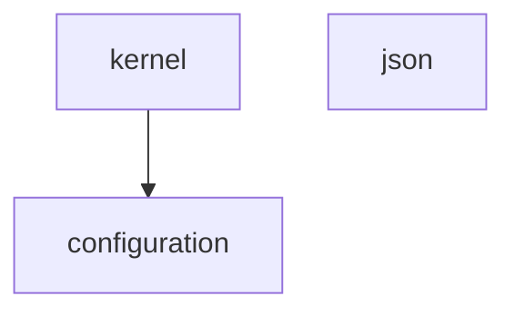
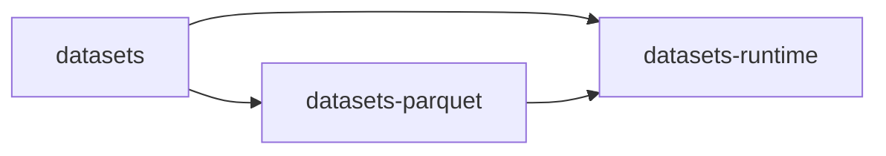
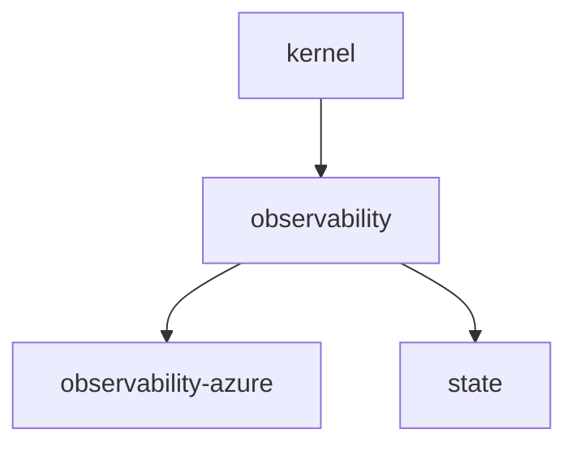
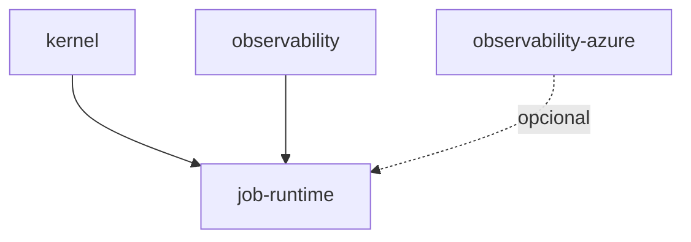

<p align="right">
  
</p>

# Backend de Atlanticus

[Volver al índice de documentación](../docs/README.md) · [Volver al README principal](../README.md)

Backend reúne las librerías Python fundamentales y reutilizables de Atlanticus. Define contratos
técnicos comunes para configuración, serialización, datasets, observabilidad, estado y ejecución
de jobs, sin incorporar reglas de una solución particular como ADA.

| Referencia | Valor |
|---|---|
| Versión del documento | `1.2.0` |
| Estado | Validado |
| Tipo de proyecto | Workspace UV no instalable |
| Python requerido | `3.14.2` |
| Unidades construibles | 10 wheels independientes |
| Salida de validación | `backend/dist/` |
| Audiencia | Desarrollo, arquitectura y mantenimiento técnico |

## Responsabilidad de la capa

Backend proporciona capacidades que pueden ser reutilizadas por Connectivity, Integrations,
Data Producers, scopes y aplicaciones sin conocer sus dominios concretos.

Sus responsabilidades son:

- definir primitivas pequeñas y contratos transversales;
- resolver configuración de procesos mediante fronteras explícitas;
- ofrecer serialización JSON y persistencia local atómicas;
- modelar datasets sin acoplarlos a una fuente de datos;
- implementar el adapter físico Parquet y su fachada operacional;
- producir observabilidad neutral y una extensión Azure separada;
- conservar estado técnico compacto entre ejecuciones;
- coordinar el ciclo de vida, leases, cancelación y recursos de jobs;
- construir wheels tipados que otras capas consumen con versiones exactas.

Backend no es un servidor ni un proceso que se levante. Sus miembros se instalan como dependencias
dentro de aplicaciones ejecutables.

## Límites arquitectónicos

| Backend sí conoce | Backend no debe conocer |
|---|---|
| Python, sistema de archivos y contratos técnicos neutrales | Reglas funcionales de ADA u otra solución. |
| Dependencias externas estrictamente necesarias para una capacidad | Catálogos de PI, Dispatch, KPI, alarmas o procesos específicos. |
| Puertos e interfaces que permiten inyectar infraestructura | Credenciales, nombres reales de recursos o ambientes corporativos. |
| Azure Monitor dentro de la extensión dedicada | Clientes de Cosmos, Storage, Service Bus, SQL, Redis o Key Vault. |
| Identidad lógica de aplicación, ambiente y volumen | Decisiones de navegación, UI, usuarios o autorización web. |

Los clientes tecnológicos pertenecen a `connectivity/`. Los adapters que conocen un sistema
externo pertenecen a `integrations/`. Las capacidades funcionales y procesos pertenecen a
`scopes/`.

La dirección válida es:

```text
backend ← connectivity / integrations ← scopes ← aplicaciones
```

Una librería de Backend no debe importar desde una capa situada a su derecha. Esta dirección evita
que una primitiva transversal dependa de una solución particular.

## Workspace y unidades de versión

`backend/pyproject.toml` organiza el workspace, la resolución local de miembros, Ruff y Pytest. Su
declaración `[tool.uv].package = false` significa que la raíz no genera un wheel.

Cada subdirectorio construible posee su propio `pyproject.toml`, nombre de distribución, API
pública y versión. Atlanticus Backend no tiene una versión única que reemplace las versiones de
sus diez miembros.

La fuente de verdad para la versión de cada wheel es `[project].version` en el `pyproject.toml` del
módulo. El procedimiento para decidir y propagar cambios pertenece a
[Versionamiento](../docs/versioning.md).

## Catálogo de módulos

| Módulo | Distribución | Import público | Responsabilidad principal | Dependencia interna directa |
|---|---|---|---|---|
| `kernel` | `atlanticus-kernel` | `atlanticus.kernel` | Ambiente, tiempo UTC, estados, sanitización y errores base. | Ninguna |
| `json` | `atlanticus-json` | `atlanticus.json` | Documentos JSON estrictos, serialización y escritura atómica. | Ninguna |
| `configuration` | `atlanticus-configuration` | `atlanticus.configuration` | Bootstrap fail-fast de variables y manifiestos de secretos. | `kernel` |
| `datasets` | `atlanticus-datasets` | `atlanticus.datasets` | Identidad, layouts, targets y resultados neutrales de datasets. | Ninguna |
| `datasets-parquet` | `atlanticus-datasets-parquet` | `atlanticus.datasets.parquet` | Persistencia física atómica con PyArrow y Parquet. | `datasets` |
| `datasets-runtime` | `atlanticus-datasets-runtime` | `atlanticus.datasets.runtime` | Fachada Pandas/PyArrow sobre los contratos y el store Parquet. | `datasets`, `datasets-parquet` |
| `observability` | `atlanticus-observability` | `atlanticus.observability` | Eventos, contexto, trazas y persistencia neutral. | `kernel` |
| `observability-azure` | `atlanticus-observability-azure` | `atlanticus.observability_azure` | Proyección acotada y exportación hacia Azure Monitor. | `observability` |
| `state` | `atlanticus-state` | `atlanticus.state` | Estado técnico compacto, firmas y reemplazo atómico. | `observability` |
| `runtime` | `atlanticus-job-runtime` | `atlanticus.runtime` | Ciclo de jobs, leases, cancelación, timeouts y recursos. | `kernel`, `observability`; Azure opcional |

El directorio `runtime` es una excepción nominal deliberada: el wheel se llama
`atlanticus-job-runtime`, pero su import público es `atlanticus.runtime`. Los consumidores deben
usar el nombre de distribución al declarar dependencias y el import dentro del código Python.

## Familias internas

Los diez módulos forman cuatro familias relacionadas, pero siguen siendo wheels independientes.

### Fundamentos y configuración



`kernel` mantiene primitivas pequeñas sin dependencias productivas. `configuration` consume esas
primitivas para resolver el ambiente y validar configuración. `json` permanece independiente para
que pueda reutilizarse sin arrastrar otra librería de Backend.

### Datasets



`datasets` declara el lenguaje neutral. `datasets-parquet` implementa el almacenamiento físico.
`datasets-runtime` ofrece la fachada que utilizan productores y consumidores de datos. La
dependencia inversa no está permitida.

### Observabilidad y estado



La observabilidad base no depende del SDK de Azure. La extensión Azure proyecta únicamente la
información permitida hacia ese proveedor. State emite eventos neutrales, pero no conoce procesos
ni catálogos funcionales.

### Ejecución de jobs



Job Runtime gobierna el ciclo de ejecución, pero recibe el trabajo funcional como una función del
proceso. No crea conectores, no interpreta datasets y no decide qué significa una iteración.

## Dependencias externas relevantes

La mayoría de los contratos base utiliza únicamente la biblioteca estándar. Las dependencias
externas aparecen cuando existe una necesidad técnica concreta:

| Módulo | Familia externa | Motivo |
|---|---|---|
| `configuration` | `python-dotenv` | Lectura local controlada de `.env`. |
| `datasets-parquet` | `pyarrow` | Schema, tablas y persistencia Parquet. |
| `datasets-runtime` | `pandas`, `pyarrow` | Frontera bidireccional de DataFrame y Table. |
| `observability-azure` | Azure Monitor y OpenTelemetry | Exportación opcional hacia Azure. |
| `runtime` | `psutil` | Muestreo neutral de recursos del proceso. |

Las versiones exactas no se repiten en este índice. Se consultan en el `pyproject.toml` propietario
y en `backend/uv.lock`, evitando que el documento quede obsoleto con cada actualización.

## Estructura de un módulo

La forma general es:

```text
backend/<módulo>/
├── pyproject.toml
├── src/atlanticus/<namespace>/
├── commented/atlanticus/<namespace>/
├── tests/
├── docs/design.md
└── README.md
```

No todos los módulos poseen todavía `README.md` o `docs/design.md`. Son recursos documentales, no
requisitos del build actual.

| Ruta | Responsabilidad |
|---|---|
| `pyproject.toml` | Metadata, versión, dependencias y contrato de construcción. |
| `src/` | Código productivo distribuido en el wheel. |
| `commented/` | Espejo pedagógico en español, excluido del wheel. |
| `tests/` | Pruebas unitarias, contratos públicos, límites y paridad del mirror. |
| `docs/design.md` | Decisiones internas que requieren mayor profundidad. |
| `README.md` | Propósito, límites, API y particularidades del módulo. |

Los packages usan el namespace `atlanticus.*` y distribuyen `py.typed` cuando declaran soporte de
tipado. El mirror comentado debe conservar estructura y comportamiento equivalentes al source; no
es una implementación alternativa.

## Consumidores

Backend es una base compartida, no una composición final:

| Consumidor | Uso esperado |
|---|---|
| `connectivity/` | Reutiliza kernel y observabilidad alrededor de clientes tecnológicos. |
| `integrations/` | Construye contratos y adapters de sistemas externos sobre capacidades base. |
| `scopes/data-producers/` | Compone datasets, runtime, state y conectores para producir datos. |
| `scopes/ada/` | Utiliza contratos backend dentro de capacidades y procesos ADA. |
| Capa web | Puede reutilizar primitivas y observabilidad sin trasladar UI a Backend. |

Que un consumidor use varios wheels no convierte Backend en un framework monolítico. Cada
aplicación selecciona únicamente las capacidades necesarias y conserva su propio bootstrap.

## Desarrollo, validación y wheels

El punto de entrada oficial de calidad es `backend/scripts/validation/check.sh`. Permite validar un
subconjunto o los diez módulos y genera únicamente los wheels seleccionados en `backend/dist/`.

El gate realiza, en este orden:

1. comprobación del lock compartido;
2. sincronización no editable;
3. aplicación de Ruff fixes y formato;
4. verificación final de Ruff;
5. pruebas del módulo;
6. comprobación del import público;
7. construcción del wheel;
8. validación de la cantidad de wheels esperada.

No es una comprobación pasiva: Ruff puede modificar source y mirror. Los cambios deben revisarse y
el gate debe repetirse hasta quedar estable antes de publicar una versión.

Los comandos completos y su contexto se mantienen en:

| Necesidad | Guía propietaria |
|---|---|
| Instalar UV, Python y sincronizar el workspace | [Primeros pasos y desarrollo](../docs/development.md) |
| Ejecutar pruebas y comprender el ciclo local | [Primeros pasos y desarrollo](../docs/development.md) |
| Construir e inspeccionar wheels | [Empaquetado](../docs/packaging.md) |
| Elegir y propagar una versión | [Versionamiento](../docs/versioning.md) |
| Resolver variables y secretos | [Configuración](../docs/configuration.md) |

Esta separación evita mantener el mismo procedimiento en el índice de área y en cada módulo.

## Incorporar un módulo nuevo

Agregar un directorio con `pyproject.toml` no basta. El catálogo del workspace actual es explícito.
Una incorporación debe revisar como mínimo:

1. responsabilidad neutral y frontera arquitectónica;
2. nombre de distribución e import público sin colisiones;
3. `backend/pyproject.toml`: `members`, `tool.uv.sources` y `testpaths`;
4. `backend/scripts/validation/check.sh`: catálogo, distribución e import;
5. equivalente BAT cuando se aborde formalmente el soporte Windows;
6. source, mirror comentado y prueba de paridad;
7. dependencias internas exactas y dirección permitida;
8. `py.typed` y exports públicos cuando corresponda;
9. README y diseño específico del módulo;
10. lock compartido, pruebas e instalación no editable;
11. wheel resultante y consumidores que deban incorporarlo.

La decisión de crear otro wheel debe justificarse por reutilización, responsabilidad independiente
o frontera técnica. No se crea un package para dividir archivos que podrían permanecer juntos.

## Estado documental de los módulos

Los README existentes son antecedentes, no documentos validados automáticamente. Algunos contienen
versiones anteriores a sus `pyproject.toml` actuales; por eso se revisarán uno por uno antes de
convertir estas rutas en enlaces.

| Módulo | Ruta | Estado documental |
|---|---|---|
| [Kernel](kernel/README.md) | `backend/kernel/README.md` | Validado |
| [JSON](json/README.md) | `backend/json/README.md` | Validado |
| Configuration | `backend/configuration/README.md` | Pendiente |
| Datasets | `backend/datasets/README.md` | Pendiente de revisión |
| Datasets Parquet | `backend/datasets-parquet/README.md` | Pendiente de revisión |
| Datasets Runtime | `backend/datasets-runtime/README.md` | Pendiente de revisión |
| Observability | `backend/observability/README.md` | Pendiente de revisión |
| Observability Azure | `backend/observability-azure/README.md` | Pendiente de revisión |
| State | `backend/state/README.md` | Pendiente de revisión |
| Job Runtime | `backend/runtime/README.md` | Pendiente de revisión |

El orden recomendado de revisión es:

1. `kernel` y `json`;
2. `configuration`;
3. `datasets`, `datasets-parquet` y `datasets-runtime`;
4. `observability` y `observability-azure`;
5. `state`;
6. `runtime`.

Ese orden sigue las dependencias internas y permite validar primero los contratos que consumen los
módulos superiores.

## Elementos no verificados o pendientes

- Los README de módulos todavía no fueron reconciliados con todas sus versiones y APIs actuales.
- `check.bat` existe, pero el soporte BAT se documentará y validará en una etapa posterior.
- No existe un registry Python corporativo ni un pipeline de publicación definido en el snapshot.
- El workspace enumera módulos en varios lugares; todavía no existe un catálogo único generado.
- No se verificó la ejecución contra Azure Monitor con credenciales reales durante esta revisión.
- No se ejecutó el gate completo de diez wheels como parte de esta modificación exclusivamente
  documental.

## Control documental

La versión `1.2.0` corresponde únicamente a este README de área. No representa una versión global
de Backend ni modifica las versiones de sus wheels.

El documento se encuentra **Validado**. Kernel y JSON también fueron validados y se incorporaron a
la navegación. `backend/configuration/README.md` es la siguiente propuesta documental pendiente.

---

[Volver al índice de documentación](../docs/README.md) · [Volver al README principal](../README.md)
