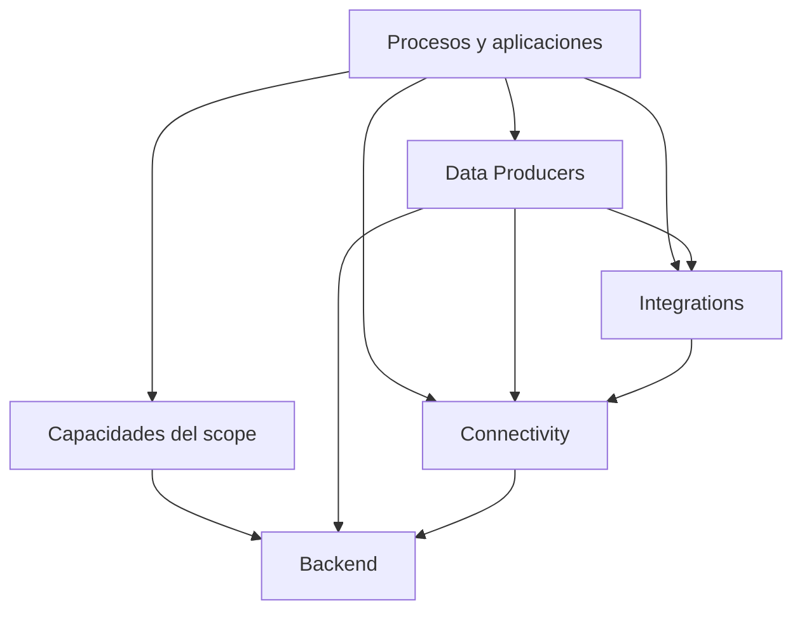
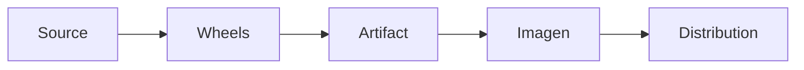

<p align="right">
  
</p>

# Arquitectura de Atlanticus

[Volver al índice de documentación](README.md) · [Volver al README principal](../README.md)

Esta guía define cómo se divide Atlanticus, qué representa cada tipo de componente y en qué
dirección pueden relacionarse sus dependencias. Su objetivo es permitir que una persona identifique
dónde vive una responsabilidad y dónde debe incorporar una capacidad nueva sin acoplar el núcleo a
una solución particular.

| Referencia | Valor |
|---|---|
| Versión del documento | `1.0.0` |
| Estado | En revisión |
| Lenguaje base | Python `3.14.2` |
| Unidad de distribución | Wheel por package construible |
| Audiencia | Arquitectura, desarrollo y mantenimiento técnico |

## Alcance

Esta guía es la fuente de verdad para:

- la clasificación arquitectónica de Atlanticus;
- la taxonomía de contratos, librerías, conectores, integraciones, capacidades y aplicaciones;
- la responsabilidad de cada área del repositorio;
- la dirección permitida de dependencias entre capas;
- la separación entre capacidades genéricas y scopes de solución;
- la relación entre source, package, wheel, artifact, imagen y distribution;
- el criterio para ubicar un componente nuevo;
- los límites entre backend, procesos, web y deployment.

No reemplaza el README de cada área o módulo. Tampoco explica comandos de desarrollo, variables,
empaquetado, versionamiento o deployment; esos procedimientos pertenecen a sus guías dedicadas.

## Fundamentos verificados

La arquitectura descrita se contrastó con los `pyproject.toml`, dependencias internas, entrypoints
y herramientas de composición presentes en el snapshot revisado.

| Evidencia | Estado actual |
|---|---|
| Raíz del repositorio | Organiza el ecosistema; no contiene un `pyproject.toml` global. |
| Backend | Workspace UV independiente con packages técnicos reutilizables. |
| Connectivity | Workspace UV independiente que consume contratos de backend. |
| Integrations | Workspace UV independiente para semántica de sistemas externos. |
| Data Producers | Proyectos autónomos reutilizables de adquisición y materialización. |
| ADA | Scope con capacidades de dominio y nueve aplicaciones backend ejecutables. |
| Procesos | Cada aplicación declara `[project.scripts]` y contrato de contenedor. |
| Deployment | Consume metadata y artifacts; no contiene lógica funcional de procesos. |
| Web | La frontera está definida, pero este snapshot no contiene una capa web integrada verificable. |

La ausencia de una capa web integrada en este snapshot no niega su lugar en Atlanticus. Significa
que esta revisión no debe inventar su estructura física, packages ni comandos.

## 1. Clasificación principal

Atlanticus es una **plataforma modular interna de software**.

No es una única aplicación porque contiene múltiples componentes con ciclos de vida independientes.
No es solamente un conjunto de librerías porque también define runtimes, contratos de composición,
artifacts, contenedores y flujos de distribución. Tampoco es un único framework instalable.

Dentro de la plataforma sí existen frameworks internos. El ejemplo backend verificado es el runtime
de jobs: recibe una definición y una iteración, administra ciclo de vida, leases, observabilidad,
límites y cierre. Ese framework es una pieza de Atlanticus, no su clasificación completa.

## 2. Taxonomía de componentes

Las palabras siguientes describen responsabilidades diferentes. No deben utilizarse como
sinónimos.

| Concepto | Definición | ¿Es ejecutable por sí mismo? |
|---|---|---:|
| Contrato | Tipos, identidades y reglas estables que permiten integrar productores y consumidores. | No |
| Librería | Package Python reutilizable que expone imports públicos. | Normalmente no |
| Framework interno | Librería que controla un ciclo de vida e invoca comportamiento aportado por consumidores. | No necesariamente |
| Connector | Cliente tecnológico genérico para un servicio, protocolo o infraestructura. | No |
| Integration | Contrato o adapter que comprende la semántica de un producto externo concreto. | No |
| Capability | Comportamiento reutilizable que puede combinar varios contratos y librerías. | No necesariamente |
| Data Producer | Capability que adquiere una fuente y la proyecta al contrato de datasets y state de Atlanticus. | No |
| Scope | Frontera de una solución o dominio con vocabulario y reglas propias. | No |
| Proceso | Aplicación backend que compone capacidades y expone un entrypoint. | Sí |
| Aplicación web | Composición ejecutable orientada a interacción, presentación y administración autorizada. | Sí |
| Artifact | Proyecto transportable con source ejecutable, lock y wheels internos. | Sí, después de sincronizarlo |
| Distribution | Entrega técnica que reúne artifacts y mecanismos de operación para un receptor. | Sí, según su runner |

### Package, import y comando

Un componente Python puede tener cuatro nombres distintos porque cada uno cumple una función:

| Identidad | Ejemplo de `kpis` | Responsabilidad |
|---|---|---|
| Ruta de source | `scopes/ada/processes/kpis/` | Ubicación dentro del repositorio. |
| Nombre de distribución | `ada-kpis-process` | Identidad declarada en `[project].name`. |
| Import | `ada.processes.kpis` | Namespace utilizado por Python. |
| Comando | `ada-kpis` | Entry point declarado en `[project.scripts]`. |

No debe inferirse una identidad a partir de otra. El `pyproject.toml` del módulo es la fuente de
verdad para package, dependencias y entrypoints.

## 3. Modelo de dependencias

La siguiente vista representa dependencias de consumo: una capa superior puede depender de una
inferior. Las capas inferiores no conocen las soluciones que las utilizan.



El grafo no significa que cada proceso deba consumir todas las capas. Cada proyecto declara
únicamente las dependencias que necesita.

### Reglas de dirección

| Consumidor | Puede depender de | No debe depender de |
|---|---|---|
| `backend/` | Packages de backend de menor nivel. | Connectivity, integrations, data producers o scopes. |
| `connectivity/` | Backend y SDK del proveedor tecnológico. | Integrations, data producers o ADA. |
| `integrations/` | Backend, connectivity y contratos del mismo sistema externo. | Data producers o soluciones finales. |
| `scopes/data-producers/` | Backend, connectivity, integrations y productores base explícitos. | Procesos o reglas exclusivas de ADA. |
| Capacidades `scopes/<solución>/` | Backend y otras capacidades explícitas del mismo scope. | Procesos ejecutables o artifacts. |
| Procesos `scopes/<solución>/processes/` | Capas inferiores y capacidades del mismo scope. | Artifacts, distributions o código generado. |
| `deployment/` y `scripts/` | Metadata, source y artifacts que necesitan transformar u operar. | No deben convertirse en dependencias importadas por el dominio. |

Las dependencias dentro de una misma capa son válidas cuando representan una dirección clara y no
forman ciclos. Pertenecer al mismo directorio no autoriza dependencias arbitrarias.

### Regla de inversión

Una capacidad genérica nunca debe importar una solución particular. Si ADA necesita adaptar una
capacidad de Atlanticus, el adapter pertenece a ADA o a una integration inferior claramente
reutilizable; no se modifica el núcleo para que conozca ADA.

La relación correcta es:

```text
ADA depende de Atlanticus
Atlanticus no depende de ADA
```

## 4. Capas del repositorio

### Backend

`backend/` contiene contratos y capacidades técnicas reutilizables que no interpretan un proceso
operacional específico.

Sus responsabilidades actuales incluyen:

- configuración y resolución de valores;
- contratos de datasets y persistencia tabular;
- serialización JSON;
- utilidades fundamentales;
- observabilidad;
- ejecución controlada de jobs;
- persistencia de state.

Los packages de backend pueden formar pequeñas cadenas internas. Por ejemplo, datasets runtime
consume los contratos de datasets y su implementación Parquet; runtime consume kernel y
observabilidad.

`observability-azure` es una extensión vinculada a un proveedor dentro del área de backend. Su
ubicación se justifica porque implementa una extensión reemplazable del contrato transversal de
observabilidad. No establece una regla para incorporar clientes de infraestructura arbitrarios en
`backend/`; esos clientes pertenecen normalmente a `connectivity/`.

### Connectivity

`connectivity/` contiene clientes genéricos para tecnologías externas. Conoce cómo comunicarse con
un servicio, pero no qué significa ese servicio para ADA u otra solución.

La capa actual incluye conectividad HTTP, Key Vault, Cosmos, Service Bus, SQL, Storage y Redis.

Un connector puede encargarse de:

- autenticación técnica;
- timeouts y política del cliente;
- operaciones CRUD o transferencia;
- lifecycle y cierre de conexiones;
- traducción de errores del SDK a errores propios del connector;
- telemetría técnica de la dependencia.

No debe seleccionar datasets de negocio, decidir turnos, calcular KPIs ni controlar una iteración
completa de un proceso.

### Integrations

`integrations/` agrega semántica de productos externos sobre connectivity.

La diferencia esencial es:

| Connectivity | Integration |
|---|---|
| Conoce HTTP. | Conoce PI Web API. |
| Ejecuta una petición. | Construye y valida una operación propia de PI. |
| Es reutilizable para múltiples productos. | Es reutilizable para consumidores del producto integrado. |

El snapshot contiene contratos PI y el adapter de PI Web API. Un catálogo de puntos específico de
ADA no pertenece a esta capa, porque representa una selección de la solución y no semántica
universal del producto PI.

### Data Producers

`scopes/data-producers/` contiene capabilities reutilizables para adquirir y materializar datos.
Aunque físicamente está bajo `scopes/`, no pertenece al dominio ADA.

Un Data Producer combina contratos de datasets, state, runtime y conectividad para resolver una
forma de adquisición. Puede conocer una fuente como PI, SQL, Storage o Service Bus, pero no es una
aplicación final porque no define por sí mismo:

- la identidad operacional de una solución;
- el conjunto completo de fuentes que deben ejecutarse;
- el calendario del producto;
- la configuración final del ambiente;
- el ciclo de deployment.

El proceso consumidor proporciona esa composición.

### Scopes de solución

`scopes/<solución>/` contiene vocabulario, contratos y reglas que no deben elevarse al núcleo por
ser propias de una solución.

El scope verificado es ADA. Actualmente contiene:

| Área ADA | Responsabilidad |
|---|---|
| `kpis/` | Contratos y capabilities de core, planificación, fuentes, evaluación, persistencia y entrega. |
| `operational-calendar/` | Reglas temporales y calendario operacional de ADA. |
| `processes/` | Aplicaciones backend ejecutables que realizan la composición final. |

Las capabilities KPI pueden dividirse en varios wheels sin dejar de representar una única familia
de dominio. Un package separado se justifica por responsabilidad y dependencias, no solo por el
tamaño del código.

### Procesos y aplicaciones backend

Un proceso es el composition root de una aplicación backend. Es la capa que:

- carga su configuración;
- construye connectors, integrations y capabilities;
- define el job y el significado de su iteración;
- expone el entrypoint público;
- declara el perfil del contenedor;
- produce outputs bajo su identidad operacional;
- puede convertirse en artifact e imagen.

La lógica reutilizable no debe permanecer enterrada dentro de un proceso. Si una responsabilidad
se reutiliza realmente o tiene un ciclo de evolución independiente, se extrae primero a la capa
propietaria y luego el proceso la consume.

El proceso tampoco debe convertirse en un orquestador genérico configurable para cualquier caso.
Su valor es componer explícitamente una aplicación concreta.

### Frontera web

La capa web de Atlanticus debe seguir el mismo principio de separación:

- la base web genérica proporciona runtime, identidad, autorización, navegación y componentes
  reutilizables;
- un scope agrega páginas, adapters y semántica pertenecientes a su solución;
- la aplicación web realiza la composición ejecutable;
- el frontend consume contratos y resultados backend; no redefine los procesos de adquisición,
  state o cálculo.

ADA puede construir herramientas como Operaciones Integradas sobre la base web y agregar
capacidades específicas sin trasladarlas al núcleo. Una capacidad visual específica de KPIs de ADA
continúa perteneciendo a ADA aunque utilice un framework web genérico de Atlanticus.

Este snapshot no permite fijar todavía rutas físicas ni comandos de la capa web. Esos contratos se
incorporarán cuando su source integrado esté disponible y validado.

### Deployment y automatización

`deployment/` contiene implementaciones para transformar y operar entregables:

- Dockerfile genérico de procesos;
- generación del workspace Compose local;
- runner incorporado a distributions;
- validaciones de esos mecanismos.

`scripts/` expone interfaces transversales desde la raíz, por ejemplo preparar artifacts, operar el
workspace local o generar una distribution.

Estas áreas pertenecen al plano de construcción y operación. No son una capa funcional importable
por los procesos.

## 5. Contratos antes que consumidores

Un contrato define la frontera antes de implementar todos sus consumidores. Esto reduce el
acoplamiento y permite reemplazar infraestructura sin cambiar el dominio.

Ejemplos verificados:

- PI contracts es consumido por la integration, los producers y los procesos PI;
- KPI core es consumido por planner, sources, evaluation, persistence y delivery;
- datasets define contratos consumidos por Parquet, runtime y capacidades superiores;
- observabilidad base es consumida por runtime, state, connectors y producers.

Definir primero el contrato no significa anticipar todas las variantes futuras. El contrato debe
contener solamente lo que un consumidor real necesita en la etapa actual.

## 6. Del source al deployment

Los siguientes contextos representan estados distintos del software:



| Contexto | Contenido | Propósito | ¿Se edita? |
|---|---|---|---:|
| Source | Código, pruebas, `pyproject.toml`, lock y documentación propietaria. | Desarrollo y fuente de verdad. | Sí |
| Wheel | Package construido e inmutable. | Distribuir una librería. | No |
| Artifact | Aplicación, source ejecutable, lock y wheels internos. | Transporte y validación autónoma. | Solo configuración y extensiones previstas para el receptor |
| Imagen | Artifact instalado dentro de un filesystem de contenedor. | Ejecución aislada. | No |
| Distribution | Uno o varios artifacts y mecanismos de entrega. | Entrega técnica seleccionada. | Solo archivos previstos para el receptor |

`artifacts/`, `distribution/`, `.runtime/`, `.venv/`, `build/` y `dist/` son salidas generadas. No
deben importarse desde el source ni utilizarse para reparar el módulo propietario.

## 7. Workspaces y proyectos autónomos

Atlanticus no tiene un único entorno Python para todo el repositorio.

| Contexto | Modelo actual |
|---|---|
| `backend/` | Workspace UV con packages miembros. |
| `connectivity/` | Workspace UV con packages miembros y enlaces editables a backend. |
| `integrations/` | Workspace UV con packages PI y enlaces editables inferiores. |
| Data Producers | Proyectos autónomos con sus propios locks. |
| Capabilities ADA | Proyectos autónomos con dependencias explícitas. |
| Procesos ADA | Proyectos autónomos ejecutables y exportables. |

Un workspace coordina desarrollo y lock; no convierte todos sus miembros en un único wheel. Cada
package construible conserva su distribución independiente.

## 8. Dónde incorporar código nuevo

La ubicación debe decidirse por responsabilidad y dirección de dependencia, no por similitud de
nombres.

| Pregunta | Ubicación recomendada |
|---|---|
| ¿Es un contrato o capacidad técnica neutral reutilizable? | `backend/` |
| ¿Es un cliente genérico de una tecnología o servicio? | `connectivity/` |
| ¿Comprende la semántica de un producto externo concreto? | `integrations/` |
| ¿Adquiere y materializa una fuente de forma reutilizable? | `scopes/data-producers/` |
| ¿Representa vocabulario o reglas exclusivas de una solución? | `scopes/<solución>/` |
| ¿Compone una aplicación backend ejecutable? | `scopes/<solución>/processes/` |
| ¿Construye, transporta u opera entregables? | `deployment/` y una interfaz en `scripts/` cuando corresponda |
| ¿Es documentación transversal? | `docs/` |

Antes de crear un package nuevo deben confirmarse al menos una de estas razones:

- reutilización real por más de un consumidor;
- responsabilidad independiente;
- dependencias o ciclo de vida diferentes;
- frontera técnica que deba permanecer reemplazable;
- necesidad de versionar y distribuir el componente de forma separada.

Si ninguna se cumple, un módulo interno dentro del package propietario suele ser suficiente.

## 9. Límites y anti-patrones

| Anti-patrón | Consecuencia |
|---|---|
| Importar ADA desde backend o connectivity | Invierte la dependencia y convierte la plataforma en parte de una solución. |
| Incorporar reglas operacionales en un connector | Hace que la infraestructura deje de ser reutilizable. |
| Duplicar modelos del mismo contrato entre capas | Introduce traducciones y divergencias innecesarias. |
| Importar desde `artifacts/` o `distribution/` | Convierte una salida generada en fuente de verdad. |
| Extraer packages solo para imitar la estructura de otro módulo | Aumenta locks, versiones y mantenimiento sin beneficio. |
| Agregar opciones genéricas a un proceso para resolver casos hipotéticos | Oculta la composición y crea un framework accidental. |
| Trasladar una capability específica de ADA al núcleo | Acopla Atlanticus a semántica que no es transversal. |
| Reimplementar runtime, configuración u observabilidad dentro de un proceso | Duplica infraestructura y rompe la armonía operacional. |

## 10. Evolución arquitectónica

Una capacidad puede moverse hacia una capa más genérica únicamente cuando exista evidencia de
reutilización y pueda expresarse sin vocabulario del scope original.

El procedimiento conceptual es:

1. identificar el contrato neutral que comparten consumidores reales;
2. separar la semántica específica del scope;
3. ubicar la implementación genérica en la capa inferior correcta;
4. conservar el adapter específico en el scope;
5. actualizar dependencias, pruebas y documentación propietaria;
6. validar que ninguna capa inferior importe la solución.

No se mantienen adapters legacy ni duplicaciones temporales salvo que exista un requisito de
compatibilidad explícito.

## Checklist arquitectónico

- [ ] La responsabilidad del cambio tiene un propietario claro.
- [ ] El contrato se definió antes de agregar consumidores.
- [ ] La dirección de dependencias apunta hacia capas inferiores.
- [ ] Backend y connectivity no importan scopes de solución.
- [ ] La semántica de un proveedor está separada del transporte genérico.
- [ ] La lógica reutilizable no quedó encerrada dentro de un proceso.
- [ ] El proceso conserva una composición explícita y un entrypoint único.
- [ ] Ningún source importa artifacts, distributions o runtime generado.
- [ ] El package nuevo tiene una razón independiente para existir.
- [ ] La documentación del módulo explica sus límites y consumidores.

## Elementos no verificados

- La capa web integrada no está presente en el snapshot revisado.
- Esta guía valida dependencias declaradas; no certifica integraciones contra infraestructura real.
- Los README existentes de algunas áreas requieren revisión antes de considerarse fuentes oficiales.
- Las decisiones específicas de deployment Azure pertenecen a la guía de deployment y al ambiente
  correspondiente.

## Control documental

La versión `1.0.0` corresponde exclusivamente a esta guía. No representa una versión global de
Atlanticus ni modifica las versiones de sus packages, wheels, aplicaciones o artifacts.

---

[Volver al índice de documentación](README.md) · [Volver al README principal](../README.md)
