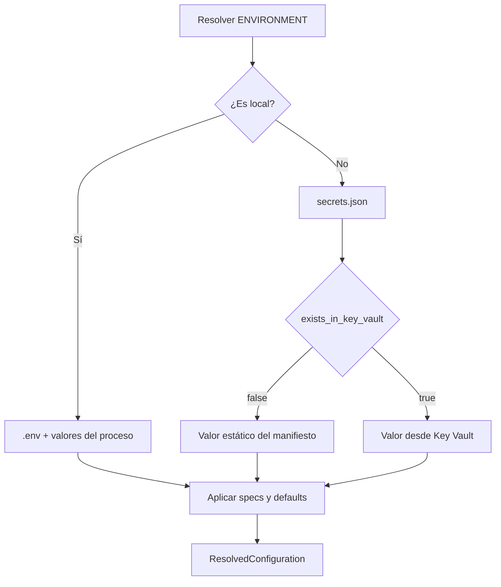

<p align="right">
  
</p>

# Configuración de Atlanticus

[Volver al índice de documentación](README.md) · [Volver al README principal](../README.md)

Esta guía explica cómo las aplicaciones backend de Atlanticus declaran, resuelven y validan su
configuración. Distingue la ejecución local, los ambientes desplegados, los secretos administrados
por Azure Key Vault y la configuración externa utilizada por la plataforma de deployment.

| Referencia | Valor |
|---|---|
| Versión del documento | `1.0.2` |
| Estado | Validado |
| Contrato base | `atlanticus-configuration` |
| Ambientes backend | `local`, `dev`, `uat`, `stg`, `prd` |
| Audiencia | Desarrollo, soporte y plataforma |

## Alcance

Esta guía es la fuente de verdad para:

- declarar el contrato de variables de una aplicación backend;
- seleccionar fuentes de configuración según el ambiente;
- entender la precedencia entre proceso, `.env`, manifiesto, Key Vault y defaults;
- diferenciar archivos activos y archivos de referencia;
- administrar valores estáticos y secretos sin confundirlos;
- resolver la identidad del Key Vault corporativo;
- proteger valores sensibles en diagnósticos;
- preparar configuración local y configuración del receptor.

No enumera todas las variables de cada proceso. El README de cada aplicación debe documentar su
catálogo, propósito, obligatoriedad y restricciones específicas. Tampoco define schedules,
recursos o mecanismos Azure concretos; esos detalles pertenecen a la guía de deployment.

## Fundamentos verificados

El flujo se contrastó con `backend/configuration`, `connectivity/key-vault`, los bootstraps de los
nueve procesos ADA, sus referencias de deployment y el generador de distributions.

| Contrato | Comportamiento actual |
|---|---|
| Selección del ambiente | Se resuelve y valida antes de elegir otras fuentes. |
| Local | Utiliza `.env`, variables del proceso y defaults. |
| Desplegado | Utiliza `secrets.json`, Key Vault y defaults. |
| Valores | Se conservan como strings; el bootstrap no aplica `strip()`. |
| Especificaciones | Solo se resuelven variables declaradas por la aplicación. |
| Resultado | Es inmutable y conserva la fuente de cada valor. |
| Secretos | Se enmascaran de forma predeterminada en exportaciones diagnósticas. |
| Preflight | Reporta variables obligatorias ausentes antes de consultar Key Vault. |
| Distribución | Conserva referencias `*.detail` y separa archivos del receptor. |

## 1. Dos tipos de configuración

Atlanticus utiliza dos contratos con responsabilidades distintas.

| Contrato | Archivos principales | Consumidor |
|---|---|---|
| Configuración funcional | `.env`, `secrets.json` | Bootstrap Python del proceso. |
| Configuración de deployment | `config.json`, `services.json` | Plataforma o repositorio consumidor. |

`config.json` no es una fuente de variables para `atlanticus-configuration`. Modificarlo puede
cambiar schedule, timeout o recursos de deployment, pero no reemplaza `APPLICATION`, conexiones,
timeouts funcionales ni secretos consumidos por el proceso.

## 2. Identidades fundamentales

### `ENVIRONMENT`

`ENVIRONMENT` identifica dónde se ejecuta el proceso backend. Los valores admitidos son exactos:

| Valor | Significado |
|---|---|
| `local` | Desarrollo o validación local. |
| `dev` | Ambiente desplegado de desarrollo. |
| `uat` | Pruebas de aceptación. |
| `stg` | Staging. |
| `prd` | Producción. |

No se aceptan mayúsculas, alias ni espacios adicionales.

`ENVIRONMENT` es una variable reservada:

- no se declara como `ConfigurationVariableSpec`;
- no puede aparecer en `secrets.json`;
- puede provenir de `.env` únicamente cuando su valor es `local`;
- en cualquier ambiente desplegado debe existir en el ambiente del proceso.

La aplicación no debe codificarse dentro de `ENVIRONMENT`. Por ejemplo, `ada-kpis` no es un
ambiente.

### `APPLICATION`

`APPLICATION` identifica el espacio lógico donde el runtime organiza datasets, logs y state. No
selecciona la fuente de configuración ni reemplaza `ENVIRONMENT`.

La relación con `VOLUMEN_PATH` se documenta en [Ejecución local](local-execution.md):

```text
<VOLUMEN_PATH>/<APPLICATION>/
```

Compartir `APPLICATION` entre procesos es una decisión de composición. No debe utilizarse el mismo
valor únicamente para agrupar archivos si los procesos requieren state independiente.

### `COMPANY_ABREV` y `PRODUCT_ABREV`

Estas identidades permiten derivar el Key Vault utilizado por los procesos desplegados. El nombre
actual se construye en minúsculas:

```text
<company>-<environment>-kv-<product>
```

Por ejemplo, valores `MLP`, `uat` y `ADA` resuelven:

```text
mlp-uat-kv-ada
```

El nombre derivado debe cumplir las restricciones de Azure implementadas por el connector: entre
3 y 24 caracteres, letras minúsculas, números o guiones válidos y sin guiones dobles.

## 3. Contrato declarado por la aplicación

Cada aplicación define una colección de `ConfigurationVariableSpec`. Esa colección es la lista
autorizada de variables funcionales que el bootstrap puede resolver.

```python
def configuration_specs() -> tuple[ConfigurationVariableSpec, ...]:
    return (
        ConfigurationVariableSpec(key='APPLICATION'),
        ConfigurationVariableSpec(key='VOLUMEN_PATH'),
        ConfigurationVariableSpec(key='SERVICE_ENDPOINT'),
        ConfigurationVariableSpec(key='SERVICE_TOKEN', sensitive=True),
        ConfigurationVariableSpec(key='POLL_INTERVAL_SECONDS', default='10'),
        ConfigurationVariableSpec(key='OPTIONAL_LABEL', required=False),
    )
```

La definición anterior es ilustrativa. Los nombres reales pertenecen al módulo que los consume.

| Campo | Significado |
|---|---|
| `key` | Nombre exacto en mayúsculas, números y guiones bajos; debe comenzar con una letra. |
| `required` | Indica si la variable debe resolverse. Su valor predeterminado es `true`. |
| `default` | Fallback textual aplicado cuando no existe un valor activo. |
| `sensitive` | Marca el valor para enmascaramiento y prohíbe declarar un default. |

Las claves duplicadas se rechazan. Una variable sensible no puede tener default porque un secreto
no debe quedar incorporado en el código.

## 4. Resolución por ambiente



### Precedencia local

En `local`, la precedencia efectiva es:

```text
valor del proceso > .env > default
```

Los valores del proceso incluyen variables del sistema operativo o inyectadas por Docker mediante
`--env-file` o Compose.

La precedencia es explícita incluso cuando el valor superior está vacío. Si el proceso define
`TOKEN=` y `.env` contiene `TOKEN=valor`, el bootstrap no recupera silenciosamente el valor
inferior: considera `TOKEN` ausente y aplica un default o informa el error correspondiente.

### Fuentes desplegadas

En `dev`, `uat`, `stg` y `prd`, la configuración funcional se resuelve mediante:

```text
secrets.json → valor estático o Key Vault → default
```

El bootstrap ignora `.env` y no utiliza variables arbitrarias del contenedor como reemplazo de los
valores declarados en el manifiesto. `ENVIRONMENT` es la excepción necesaria para seleccionar el
ambiente antes de abrir otras fuentes.

Los bootstraps actuales pueden considerar `COMPANY_ABREV` y `PRODUCT_ABREV` del ambiente del
proceso al derivar el vault, pero esto no convierte al ambiente del contenedor en una fuente
general de configuración desplegada. Las referencias oficiales mantienen ambas identidades como
valores estáticos del manifiesto.

### Defaults

Los defaults pertenecen al contrato de código y se aplican después de la fuente correspondiente al
ambiente. Un default solo debe representar un comportamiento seguro y transversal. Valores que
cambian por receptor o ambiente deben permanecer en `.env` o `secrets.json`.

## 5. Archivos y responsabilidades

| Archivo | ¿Se entrega? | ¿Se lee al ejecutar? | Propietario |
|---|---:|---:|---|
| `.env.detail` | Sí | No | Módulo fuente; referencia local. |
| `.env` | No como contrato | Sí, en local | Desarrollador u operador local. |
| `secrets.detail.json` | Sí | No | Módulo fuente; referencia desplegada. |
| `secrets.json` | Lo aporta el receptor | Sí, en desplegado | Repositorio o plataforma consumidora. |
| `config.detail.json` | Sí | No | Módulo fuente; referencia de deployment. |
| `config.json` | Lo aporta el receptor | No por el proceso Python | Repositorio o plataforma consumidora. |
| `services.json` | Se genera en la distribution | No por el proceso Python | Herramienta de distribución. |

### `.env.detail`

Es la plantilla versionada para ejecución local. Debe:

- listar las variables que la aplicación permite configurar localmente;
- utilizar valores de ejemplo seguros;
- dejar placeholders o valores vacíos cuando el receptor debe completarlos;
- declarar `ENVIRONMENT=local`;
- usar una referencia de `VOLUMEN_PATH` que el usuario reemplace por su ruta absoluta real;
- no contener credenciales válidas.

Se copia como `.env` antes de ejecutar:

```bash
cp .env.detail .env
```

### `.env`

Es un archivo activo y local. Puede contener credenciales reales necesarias para desarrollo, por
lo que no debe publicarse, empaquetarse ni enviarse como parte de una entrega.

El snapshot revisado no contiene una política raíz `.gitignore` que permita asumir protección
automática. La ausencia de seguimiento debe comprobarse antes de cada commit; no debe confiarse en
que Git lo excluirá por sí solo.

### `secrets.detail.json`

Es la referencia versionada del manifiesto desplegado. En los procesos actuales cubre las mismas
variables de `.env.detail`, excepto `ENVIRONMENT`, que está reservada.

Debe contener placeholders seguros para nombres de secretos y únicamente valores estáticos que no
sean sensibles.

### `secrets.json`

Es el manifiesto activo que lee el proceso en un ambiente desplegado. No es un almacén de secretos:
indica qué variables son estáticas y cuáles deben resolverse desde Key Vault.

Puede mantenerse en el repositorio consumidor cuando la política corporativa lo permita, siempre
que no incluya secretos reales. Los valores sensibles deben estar en Key Vault y representarse en
el manifiesto mediante su nombre.

### `config.detail.json` y `config.json`

`config.detail.json` es una referencia de deployment con datos como trigger, cron, timeout,
parallelism, nombre de contenedor y recursos.

El receptor lo copia o adapta como `config.json`. Este archivo es referenciado por la entrega y no
es leído por el bootstrap Python. No debe contener credenciales.

### `services.json`

La herramienta de distribución genera este catálogo para los procesos seleccionados. Cada entrada
apunta al `config.json` del receptor correspondiente. Su estructura y uso operacional pertenecen a
la guía de deployment.

## 6. Contrato de `secrets.json`

La raíz debe ser un array JSON. Cada entrada admite exactamente cuatro campos:

```json
{
  "var_name": "SERVICE_CONNECTION_STRING",
  "secret_name": "secret-service-connection-string",
  "value": null,
  "exists_in_key_vault": true
}
```

| Campo | Contrato |
|---|---|
| `var_name` | Variable funcional declarada por la aplicación. |
| `secret_name` | Nombre exacto del secreto en Key Vault o `null`. |
| `value` | Valor estático no sensible o `null`. |
| `exists_in_key_vault` | Selector booleano y autoritativo de la fuente. |

### Entrada resuelta desde Key Vault

```json
{
  "var_name": "SERVICE_CONNECTION_STRING",
  "secret_name": "secret-service-connection-string",
  "value": null,
  "exists_in_key_vault": true
}
```

Cuando `exists_in_key_vault` es `true`:

- `secret_name` es obligatorio;
- el bootstrap solicita el secreto por ese nombre;
- `value` no actúa como fallback;
- el resultado se marca automáticamente como sensible.

### Entrada estática

```json
{
  "var_name": "POLL_INTERVAL_SECONDS",
  "secret_name": null,
  "value": "10",
  "exists_in_key_vault": false
}
```

Cuando `exists_in_key_vault` es `false`:

- `value` debe ser un string no vacío;
- `secret_name` no se consulta;
- el valor se identifica como procedente del manifiesto.

El selector es autoritativo. Aunque el campo inactivo contenga datos, el bootstrap lo ignora. Para
evitar ambigüedad, las referencias oficiales utilizan `null` en el campo inactivo.

### Validaciones estructurales

El manifiesto rechaza:

- una raíz que no sea array;
- entradas que no sean objetos;
- campos obligatorios ausentes;
- campos desconocidos;
- variables duplicadas;
- nombres de variable inválidos;
- una entrada para `ENVIRONMENT`;
- `exists_in_key_vault` que no sea booleano;
- una fuente activa sin `secret_name` o `value` válido.

El manifiesto solo exige que `secret_name` sea texto no vacío. La regla Azure de 1 a 127 letras,
números o guiones se valida posteriormente en `KeyVaultClient`, cuando el resolver concreto realiza
la consulta. Esta separación permite que el contrato de Configuration permanezca neutral respecto
del proveedor.

## 7. Valores, tipos y normalización

El bootstrap conserva todos los valores como strings. No recorta espacios ni interpola referencias
de dotenv.

```dotenv
URL=https://${DOMAIN}/api
```

El valor anterior permanece literalmente como `https://${DOMAIN}/api`; Atlanticus no sustituye
`${DOMAIN}`.

| Entrada | Resultado del bootstrap |
|---|---|
| `VALUE=` | Ausente. |
| `VALUE= ` | String con un espacio. |
| `VALUE=  text  ` | String con espacios conservados. |
| Variable inexistente con default | Default textual. |

Conservar el contenido exacto no significa que cualquier valor sea válido. Después del bootstrap,
cada módulo aplica sus propias restricciones: URLs absolutas, rangos, enteros positivos, nombres de
aplicación o rutas absolutas, entre otras.

`ResolvedConfiguration` proporciona conversiones estrictas:

| Conversión | Valores admitidos |
|---|---|
| Booleano verdadero | `1`, `true`, `yes`, `on` |
| Booleano falso | `0`, `false`, `no`, `off` |
| Entero | Texto aceptado por `int()`. |

Los booleanos no distinguen mayúsculas después de resolver el string. Los nombres de ambiente sí
son exactos.

## 8. Resolución de Key Vault

Key Vault solo se abre cuando existe al menos una variable configurada que declara
`exists_in_key_vault=true`.

El connector:

- deriva el vault desde compañía, ambiente y producto;
- utiliza `DefaultAzureCredential`;
- mantiene un único cliente durante el bootstrap;
- lee secretos por nombre exacto;
- cierra credencial y cliente al terminar;
- no expone el valor secreto en el error del bootstrap.

La identidad de ejecución debe tener acceso al vault correspondiente. Atlanticus no documenta ni
incorpora credenciales explícitas para autenticar el connector.

Los fallos se informan mediante la variable funcional, no mediante el valor secreto ni detalles
internos de la credencial.

## 9. Configuración resuelta y valores sensibles

El resultado es una `ResolvedConfiguration` inmutable que contiene:

- ambiente validado;
- mapping de valores;
- mapping de fuentes;
- conjunto de claves sensibles.

Las fuentes posibles son:

| Fuente | Significado |
|---|---|
| `process` | Ambiente del proceso o valor local inyectado. |
| `dotenv` | Archivo `.env` local. |
| `manifest` | Valor estático de `secrets.json`. |
| `key_vault` | Secreto resuelto externamente. |
| `default` | Default declarado por el spec. |

`repr(configuration)` muestra únicamente nombres de claves. `to_dict()` enmascara las sensibles
con `***`.

Aunque existe `to_dict(mask_sensitive=False)` para consumidores controlados, su resultado no debe
registrarse, enviarse a telemetría ni incluirse en excepciones.

## 10. Ciclo de los archivos del receptor

Al preparar un artifact se incluyen las referencias:

```text
.env.detail
config.detail.json
secrets.detail.json
```

Los archivos activos del receptor son:

```text
.env
config.json
secrets.json
```

El generador de distributions:

- no importa `.env`, `config.json` ni `secrets.json` desde el artifact;
- conserva los archivos activos que ya existen en una distribution del mismo receptor al
  regenerarla;
- exige que cada artifact contenga los tres archivos de referencia;
- informa qué archivos activos faltan después de generar la entrega.

Esto evita que una configuración accidental del ambiente de construcción alcance al receptor y, al
mismo tiempo, permite actualizar artifacts sin borrar la configuración ya preparada por ese
receptor.

## 11. Responsabilidad documental de cada módulo

El README de una aplicación que usa configuración debe incluir:

1. tabla de variables exclusivas;
2. propósito de cada variable;
3. obligatoriedad y default real;
4. indicación de sensibilidad;
5. valores admitidos o restricciones;
6. relación con otros procesos o `APPLICATION` cuando exista;
7. fuentes externas requeridas;
8. diferencias entre ejecución local y desplegada;
9. outputs afectados por la configuración;
10. enlace a esta guía para el mecanismo transversal.

No debe copiar toda la explicación de `.env`, manifiestos o Key Vault. Solo documentará lo que
cambia en ese módulo.

## 12. Incorporar una variable nueva

Una variable nueva requiere mantener alineados sus contratos:

1. agregar el `ConfigurationVariableSpec` en la aplicación propietaria;
2. decidir si es obligatoria, opcional, sensible o tiene default;
3. consumirla mediante `ResolvedConfiguration` y validar su semántica;
4. agregar una referencia segura en `.env.detail`;
5. agregar la entrada correspondiente en `secrets.detail.json`, excepto para `ENVIRONMENT`;
6. actualizar pruebas de settings, bootstrap y referencias de deployment;
7. documentarla en el README del módulo;
8. regenerar y validar el artifact.

No debe agregarse una variable solo para evitar definir un contrato en código. Las variables son
adecuadas para valores que cambian por ambiente o receptor, no para transformar reglas de dominio
estables en configuración dinámica.

## Errores frecuentes

| Síntoma | Causa probable | Revisión |
|---|---|---|
| `ENVIRONMENT` es inválido | Alias, mayúsculas, espacios o valor no soportado. | Usar uno de los cinco valores exactos. |
| `.env` funciona localmente pero se ignora desplegado | Los ambientes no-local no leen dotenv. | Configurar `secrets.json` y Key Vault. |
| Una variable del contenedor no reemplaza el manifiesto | No es una fuente funcional desplegada. | Actualizar el manifiesto del receptor. |
| Faltan varias variables en un único error | El preflight valida el contrato completo. | Corregir todas antes de reintentar. |
| El valor de `.env` no se expande | La interpolación está deshabilitada. | Escribir el valor final completo. |
| Un valor con espacios falla después del bootstrap | El core conserva espacios, pero el módulo los prohíbe. | Corregir el valor; no depender de trim implícito. |
| El proceso solicita el vault equivocado | Compañía, producto o ambiente no corresponden. | Revisar la identidad derivada. |
| Key Vault responde 401 o 403 | La identidad no autenticó o no tiene autorización. | Revisar identidad y permisos del ambiente. |
| Se editó `config.json` y el proceso no cambió | Ese archivo pertenece al deployment. | Modificar la fuente funcional correcta. |

## Checklist de seguridad

- [ ] `.env` no está incluido en el commit ni en el paquete de entrega.
- [ ] `.env.detail` no contiene credenciales reales.
- [ ] `secrets.detail.json` utiliza placeholders seguros.
- [ ] `secrets.json` no almacena valores sensibles en `value`.
- [ ] Cada secreto activo tiene `exists_in_key_vault=true` y `value=null`.
- [ ] Los nombres de secretos corresponden al vault derivado para el ambiente.
- [ ] `config.json` no contiene secretos.
- [ ] Los logs utilizan la vista enmascarada de la configuración.
- [ ] Los errores no incluyen credenciales ni valores resueltos.
- [ ] La configuración del receptor se conserva fuera del artifact fuente.

## Elementos no verificados

- El snapshot no contiene una política raíz `.gitignore` para `.env`.
- La plataforma externa que consume `config.json` y `services.json` no está implementada en este
  repositorio; solo se verificó el contrato de distribución.
- La autenticación y autorización contra Key Vault requieren validación en cada ambiente real.
- La configuración de la capa web integrada no está presente en este snapshot y no se asume
  equivalente al contrato backend `ENVIRONMENT`.

## Control documental

La versión `1.0.2` corresponde exclusivamente a esta guía. No representa una versión de Atlanticus,
de `atlanticus-configuration`, de los procesos ni de sus artifacts.

---

[Volver al índice de documentación](README.md) · [Volver al README principal](../README.md)
