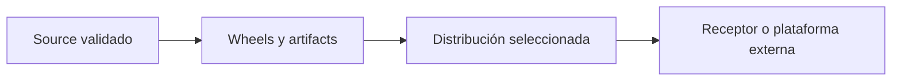

<p align="right">
  
</p>

# Deployment y distribuciones

[Volver al índice de documentación](README.md) · [Volver al README principal](../README.md)

Esta guía explica cómo Atlanticus transforma artifacts de procesos ya preparados en contenedores
y distribuciones técnicas para un receptor. También delimita qué mecanismos existen realmente en
el repositorio y cuáles todavía dependen de una plataforma externa o de trabajo futuro.

| Referencia | Valor |
|---|---|
| Versión del documento | `1.0.1` |
| Estado | Validado |
| Python requerido para generar una distribución | `3.14.2` |
| Gestor utilizado durante la preparación | UV |
| Tecnología de contenedores soportada | Docker y Docker Compose |
| Audiencia | Desarrollo, soporte, plataforma y responsables de entrega |

## Alcance

Esta guía es la fuente de verdad para:

- diferenciar artifact, imagen, workspace Compose y distribución;
- entender el contrato de contenedor común de los procesos;
- generar una distribución seleccionada o completa;
- identificar qué archivos son plantillas y cuáles debe crear el receptor;
- conocer qué se conserva al regenerar una entrega con el mismo nombre;
- validar estructuralmente una distribución;
- ejecutar su modalidad E2E local cuando sea seguro hacerlo;
- distinguir un directorio de distribución de un deployment productivo;
- registrar limitaciones y riesgos todavía no resueltos.

No explica el desarrollo cotidiano, la ejecución desde source o artifact con UV, la construcción
interna de wheels ni el significado funcional de una iteración. Esos temas pertenecen a
[Primeros pasos y desarrollo](development.md), [Ejecución local](local-execution.md),
[Empaquetado](packaging.md) y al README de cada proceso.

Tampoco define un deployment Azure, un registry de imágenes, un pipeline CI/CD, rollback,
observabilidad de plataforma ni administración de credenciales. Esas capacidades no están
representadas como contratos completos en el snapshot actual.

## Qué significa deployment en el repositorio actual

Atlanticus posee mecanismos de **preparación para deployment**, pero no un único comando que
publique una solución en la nube.

| Unidad | Qué contiene | Para qué sirve |
|---|---|---|
| Wheel | Una librería Python construida | Distribuir una dependencia interna versionada. |
| Artifact | Source ejecutable, lock, wheels y referencias de configuración | Transportar un proceso autónomo y reproducible. |
| Imagen | Un artifact instalado dentro del runtime Docker común | Validar y ejecutar el contrato de contenedor. |
| Workspace local | Compose generado desde `artifacts/` | Probar localmente artifacts preparados. |
| Distribución | Selección exacta de artifacts, Dockerfile, Compose, manifiestos y runner | Entregar uno o varios procesos a un receptor técnico. |
| Deployment productivo | Recursos, secretos, scheduling y operación de una plataforma | No está automatizado en este repositorio. |

El flujo implementado termina en una carpeta de distribución:



`scripts/distribute-processes.sh` no construye los artifacts y no genera un ZIP. Consume artifacts
existentes, los valida y produce un directorio de entrega.

## Prerrequisitos

Para generar una distribución se necesita:

- ejecutar desde la raíz del repositorio;
- UV disponible;
- Python `3.14.2` disponible para UV;
- artifacts previamente preparados y validados;
- nombres de distribución y procesos en formato kebab-case.

Docker no es necesario para crear la carpeta de distribución. Solo es necesario para construir
sus imágenes o ejecutar la modalidad E2E local.

Verificaciones básicas:

```bash
uv --version
uv python find 3.14.2
```

Cuando también se probarán contenedores:

```bash
docker --version
docker compose version
```

La instalación inicial de UV y Python está documentada en
[Primeros pasos y desarrollo](development.md).

## 1. Preparar los artifacts de entrada

La distribución consume resultados de `artifacts/processes/`; no construye desde el source de los
procesos.

Preparar una selección:

```bash
./scripts/local-process.sh prepare kpis kpis-historian
```

Preparar todos los procesos soportados:

```bash
./scripts/local-process.sh prepare --all
```

Cada artifact debe contener al menos:

- `pyproject.toml`;
- `uv.lock`;
- `wheels/`;
- `src/`;
- `.env.detail`;
- `config.detail.json`;
- `secrets.detail.json`.

La construcción, inspección y certificación de ese resultado se explica en
[Empaquetado](packaging.md). Una distribución no debe utilizarse para ocultar un artifact inválido.

## 2. Contrato común de imagen

Todos los procesos utilizan `deployment/processes/Dockerfile`. Su contexto de build debe contener
el proceso en `processes/<nombre>`.

El Dockerfile:

1. valida el nombre recibido mediante `FILENAME`;
2. copia el artifact seleccionado al stage de construcción;
3. comprueba Python, lock, wheels, fuentes internas y metadata de contenedor;
4. ejecuta `uv sync --frozen --no-dev --no-cache`;
5. copia el proyecto instalado al stage runtime;
6. resuelve y ejecuta el comando declarado en `[project.scripts]`.

Los argumentos base actuales son:

| Argumento | Valor predeterminado | Responsabilidad |
|---|---|---|
| `FILENAME` | Obligatorio al construir | Selecciona `processes/<nombre>`. |
| `PYTHON_IMAGE` | `python:3.14.2-slim-bookworm` | Define la imagen base del builder y runtime. |
| `UV_IMAGE` | `ghcr.io/astral-sh/uv:0.10.0` | Proporciona el binario de UV al builder. |

Cada aplicación declara además `[tool.atlanticus.container]` en su `pyproject.toml`:

- `command`: entrypoint que se ejecutará dentro del contenedor;
- `profile = "base"`: runtime Python sin paquetes de sistema adicionales;
- `profile = "sqlserver"`: instala Microsoft ODBC Driver 18 en la imagen runtime;
- `resources`: CPU y memoria utilizados al generar Compose.

Una imagen directa de un artifact se construye como se documenta en
[Ejecución local](local-execution.md). Esta guía no repite ese procedimiento porque el contrato de
ejecución es el mismo dentro y fuera de una distribución.

## 3. Generar una distribución

Crear una distribución seleccionada:

```bash
./scripts/distribute-processes.sh ada-local kpis kpis-historian
```

Crear una distribución con todos los procesos soportados:

```bash
./scripts/distribute-processes.sh ada-local --all
```

La forma general es:

```text
./scripts/distribute-processes.sh <distribución> <proceso> [<proceso> ...]
./scripts/distribute-processes.sh <distribución> --all
```

No se permite mezclar `--all` con nombres explícitos, repetir procesos ni solicitar un nombre que
no pertenezca al catálogo estable.

El resultado se crea en:

```text
distribution/<distribución>/
```

La generación utiliza staging y reemplazo controlado. Primero valida todos los artifacts; si algo
falla antes de completar la nueva entrega, no debe dejar una distribución parcial como resultado
válido.

## 4. Estructura de la entrega

Una distribución contiene una selección cerrada:

```text
distribution/ada-local/
├── Dockerfile
├── .dockerignore
├── services.json
├── processes/
│   ├── kpis/
│   │   ├── pyproject.toml
│   │   ├── uv.lock
│   │   ├── wheels/
│   │   ├── src/
│   │   ├── .env.detail
│   │   ├── config.detail.json
│   │   └── secrets.detail.json
│   └── kpis-historian/
├── local-deployment/
│   ├── compose.yaml
│   └── compose.bind.yaml
└── scripts/
    └── local-process.sh
```

También se entrega el mirror comentado del runner cuando forma parte del contrato generado. No es
el script operativo principal.

Regenerar `ada-local` con una selección diferente reemplaza la selección anterior: los procesos
que ya no fueron solicitados se retiran de esa distribución. El nombre de la distribución no
representa un contenedor incremental donde se acumulen procesos.

## 5. Plantillas y archivos activos

Las plantillas describen el contrato sin contener valores reales:

| Plantilla versionada | Archivo activo del receptor | Uso |
|---|---|---|
| `.env.detail` | `.env` | Variables para ejecución local con UV o Compose. |
| `config.detail.json` | `config.json` | Configuración consumida por la plataforma receptora. |
| `secrets.detail.json` | `secrets.json` | Manifiesto de secretos consumido por la plataforma receptora. |

El generador no crea valores activos. Como inicio controlado, el receptor puede copiar las
plantillas y después sustituir todos los placeholders:

```bash
cd distribution/ada-local
cp processes/kpis/.env.detail processes/kpis/.env
cp processes/kpis/config.detail.json processes/kpis/config.json
cp processes/kpis/secrets.detail.json processes/kpis/secrets.json
```

No deben publicarse credenciales ni valores reales en Git, artifacts, imágenes o paquetes de
documentación.

Cuando se regenera una distribución existente con el mismo nombre y el mismo proceso, el generador
preserva `.env`, `config.json` y `secrets.json` del receptor. Las plantillas, el source, los wheels,
los locks, Compose y los manifiestos generados se actualizan desde los artifacts actuales.

La conservación evita perder configuración local, pero no certifica que continúe siendo compatible
con una plantilla nueva. Después de regenerar se deben comparar los contratos y completar campos
nuevos antes de operar.

## 6. Contrato de `services.json`

`services.json` describe los procesos seleccionados para un consumidor externo. Actualmente cada
entrada contiene:

| Campo | Responsabilidad |
|---|---|
| `repository` | Nombre del proceso o repositorio lógico. |
| `excecution_file` | Ruta del archivo de configuración activo. |
| `container_name` | Identidad operacional asignada al job. |
| `config_file` | Ruta de `config.json` dentro de la distribución. |
| `to_deploy` | Marca inicial para despliegue. |
| `to_stop` | Marca inicial de detención. |
| `to_working_hours_dev` | Política inicial para desarrollo. |
| `to_working_hours_uat` | Política inicial para UAT. |

`excecution_file` conserva una grafía incorrecta en el contrato actual. No debe corregirse solo en
la documentación ni manualmente en una entrega: cambiarlo requiere coordinar el generador y el
consumidor externo.

El repositorio genera el manifiesto, pero no contiene la implementación completa de la plataforma
que interpreta todos sus campos. Por eso su comportamiento productivo necesita verificación
externa.

## 7. Compose generado

La distribución incorpora dos modalidades:

| Archivo | Volumen | Uso esperado |
|---|---|---|
| `local-deployment/compose.yaml` | Volumen nombrado Docker | E2E local con persistencia administrada por Docker. |
| `local-deployment/compose.bind.yaml` | Directorio enlazado del host | Inspección directa de datasets, logs y state. |

Los servicios se generan con:

- una imagen independiente por proceso;
- build context en la raíz de la distribución;
- `.env` como archivo de variables del contenedor;
- `VOLUMEN_PATH=/app/volume` dentro del contenedor;
- el volumen compartido montado en `/app/volume`;
- `command: ["--run-once"]` como comando predeterminado;
- CPU y memoria obtenidas de `[tool.atlanticus.container.resources]`.

Los recursos de Compose no se leen desde `config.detail.json`. Son dos contratos separados: el
`pyproject.toml` alimenta el Compose local y `config.json` pertenece al consumidor de deployment.

El volumen no se elimina con `down`; esto preserva los outputs entre ejecuciones. Si se requiere
una prueba totalmente limpia, debe aplicarse el procedimiento controlado de
[Ejecución local](local-execution.md).

## 8. Validación local de la distribución

Desde la raíz de la distribución:

```bash
cd distribution/ada-local
./scripts/local-process.sh validate
```

`validate` comprueba únicamente:

- existencia de ambos archivos Compose;
- existencia de `.env` para cada proceso seleccionado.

No comprueba Docker, credenciales, conectividad, `config.json`, `secrets.json`, schemas externos ni
el resultado funcional de un job. Su éxito significa **estructura local mínima disponible**, no
deployment aprobado.

El runner también expone:

```text
scripts/local-process.sh up [--bind]
scripts/local-process.sh down
scripts/local-process.sh ps
scripts/local-process.sh logs [process]
scripts/local-process.sh run <process>
```

La semántica de ejecución, logs, `--run-once` y volúmenes se mantiene en
[Ejecución local](local-execution.md).

### Limitación actual del modo bind

`up --bind` utiliza `compose.bind.yaml`, pero `down`, `ps`, `logs` y `run` seleccionan actualmente
`compose.yaml`. Mientras el runner no conserve o reciba el modo elegido, esas operaciones no
administran necesariamente el conjunto bind iniciado.

Para operar explícitamente el modo bind debe indicarse el archivo Compose:

```bash
docker compose -f local-deployment/compose.bind.yaml ps -a
docker compose -f local-deployment/compose.bind.yaml logs -f kpis
docker compose -f local-deployment/compose.bind.yaml run --rm kpis --run-once
docker compose -f local-deployment/compose.bind.yaml down --remove-orphans
```

Esta solución es operativa, pero la inconsistencia del runner sigue siendo deuda técnica y debe
corregirse antes de presentar `--bind` como una experiencia uniforme.

## 9. Bloqueo de seguridad del E2E distribuido

La ejecución Docker desde una distribución con valores reales **no se considera aprobada en el
estado actual**.

La causa verificada es la combinación de estos contratos:

1. el receptor debe crear `.env`, `config.json` y `secrets.json` dentro de
   `distribution/<nombre>/processes/<proceso>/`;
2. `.dockerignore` vuelve a incluir todo el árbol `processes/**` en el contexto;
3. el Dockerfile copia el directorio completo del proceso durante el build.

Por lo tanto, archivos activos presentes en ese directorio pueden llegar al contexto y a capas de
la imagen. Pasar `.env` mediante `env_file` en Compose no elimina ese riesgo durante el build.

Hasta corregir el contrato de construcción:

- se puede generar e inspeccionar una distribución sin credenciales reales;
- se pueden validar sus plantillas y manifiestos;
- no se debe ejecutar `up` después de colocar secretos reales bajo `processes/`;
- no se debe publicar ni compartir una imagen construida desde ese contexto;
- el workspace local generado desde `artifacts/` excluye `.env` al copiar cada artifact al contexto
  temporal y es la vía Docker preferida para pruebas;
- `config.json` y `secrets.json` tampoco deben colocarse dentro de los artifacts usados por ese
  workspace, porque el generador actual solo excluye `.env`.

La corrección técnica recomendada es excluir de forma explícita `.env`, `config.json` y
`secrets.json` del contexto y limitar los `COPY` a archivos requeridos. Además debe agregarse una
prueba que inspeccione el contexto o la imagen y falle si encuentra archivos activos. Esa
corrección pertenece a código y pruebas, no a esta etapa documental.

## 10. Qué debe validar el receptor

### Integridad de la entrega

- [ ] La selección de procesos coincide con lo solicitado.
- [ ] Cada proceso contiene source, lock, wheels y las tres plantillas.
- [ ] `services.json` referencia únicamente procesos presentes.
- [ ] Ambos Compose contienen los mismos servicios.
- [ ] No existen `.env`, `config.json` ni `secrets.json` heredados de otro receptor.
- [ ] Las versiones y checks del artifact fueron certificados antes de distribuir.

### Configuración del ambiente

- [ ] Cada placeholder fue sustituido conscientemente.
- [ ] Los nombres de secretos corresponden al ambiente receptor.
- [ ] La identidad `APPLICATION` y la raíz de volumen son coherentes entre procesos que comparten
      datos.
- [ ] CPU, memoria, scheduling, timeout y réplicas fueron revisados por la plataforma.
- [ ] Existen permisos y conectividad hacia PI, Cosmos, SQL, Storage, Service Bus u otros servicios
      requeridos por cada proceso.

### Gate previo a deployment

- [ ] El riesgo de archivos activos dentro de la imagen fue corregido y probado.
- [ ] La imagen fue construida desde artifacts certificados.
- [ ] Se verificó su contenido sin exponer secretos en logs.
- [ ] El entrypoint y una ejecución controlada producen el resultado esperado.
- [ ] Existe una estrategia externa de publicación, rollback y monitoreo.

Cumplir la estructura de la distribución no sustituye este gate.

## 11. Límites y trabajo pendiente

| Tema | Estado actual |
|---|---|
| Generación seleccionada | Implementada y validada localmente por el generador. |
| Generación de ZIP | No implementada por `distribute-processes.sh`. |
| Build de imagen común | Implementado para perfiles `base` y `sqlserver`. |
| E2E Docker desde artifacts | Soportado mediante el workspace local. |
| E2E Docker desde distribución con secretos reales | Bloqueado por el contexto de build actual. |
| Usuario no privilegiado | El Dockerfile no declara `USER`; el runtime conserva el usuario predeterminado. |
| Healthcheck y restart | No están definidos en el Compose generado. |
| Imágenes base por digest | Se utilizan tags; no hay pin por digest. |
| Registry, firma, SBOM y escaneo | No están definidos. |
| CI/CD y promoción entre ambientes | No están definidos. |
| Deployment cloud | No está implementado en este repositorio. |
| Rollback | No existe un mecanismo documentado o automatizado. |
| Validación de `config.json` y `secrets.json` | No forma parte del runner local. |
| Consumidor de `services.json` | Requiere documentación y verificación externas. |

Los procesos programados usan `--run-once` en Compose; la ausencia de restart o healthcheck no debe
corregirse copiando políticas propias de un servicio web. El runtime productivo debe diseñarse
según el tipo de aplicación: job programado, worker continuo o servicio HTTP.

## Errores frecuentes

| Síntoma | Causa probable | Corrección |
|---|---|---|
| `artifact not found` | El proceso no fue preparado. | Generar y validar el artifact antes de distribuir. |
| `invalid distribution name` | El nombre no usa kebab-case. | Utilizar minúsculas, números y guiones simples. |
| `unknown process` | El nombre no pertenece al catálogo estable. | Revisar los procesos aceptados por el script. |
| Falta `.env` al ejecutar `validate` | Solo existe `.env.detail`. | Crear el archivo local y completar sus placeholders. |
| `validate` pasa, pero falta configuración | El runner no comprueba `config.json` ni `secrets.json`. | Aplicar el checklist del receptor. |
| Un proceso anterior desapareció | La nueva distribución utilizó una selección exacta diferente. | Incluir explícitamente todos los procesos requeridos. |
| Una plantilla nueva no coincide con el archivo activo | La regeneración preservó la configuración anterior. | Comparar contratos y migrar el archivo activo. |
| `down` no detiene el modo bind | El runner usa el Compose nombrado para esa operación. | Ejecutar Docker Compose con `compose.bind.yaml`. |
| La imagen puede contener archivos activos | El contexto incluye todo `processes/**`. | No construir con secretos reales hasta corregir el contrato. |

## Control documental

La versión `1.0.1` corresponde exclusivamente a esta guía. No representa una versión de
Atlanticus, de sus procesos, artifacts, imágenes o distribuciones.

El documento se encuentra **Validado**. Sus rutas y comandos fueron contrastados con el snapshot,
pero la ejecución Docker de una distribución con credenciales reales permanece explícitamente
bloqueada hasta resolver y probar el aislamiento del contexto de build.

---

[Volver al índice de documentación](README.md) · [Volver al README principal](../README.md)
