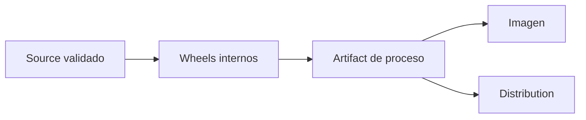

<p align="right">
  
</p>

# Empaquetado de Atlanticus

[Volver al índice de documentación](README.md) · [Volver al README principal](../README.md)

Esta guía explica cómo Atlanticus construye, inspecciona y valida sus wheels y artifacts de
procesos. Ambos son resultados empaquetados, pero resuelven necesidades distintas y no deben
tratarse como equivalentes.

| Referencia | Valor |
|---|---|
| Versión del documento | `1.0.0` |
| Estado | En revisión |
| Python requerido | `3.14.2` |
| Herramienta de build | UV con `setuptools.build_meta` |
| Audiencia | Desarrollo, mantenimiento técnico y plataforma |

## Alcance

Esta guía es la fuente de verdad para:

- diferenciar wheel, artifact de proceso, imagen y distribution;
- construir wheels desde workspaces y proyectos autónomos;
- inspeccionar el contenido y metadata de un wheel;
- generar uno o varios artifacts de procesos ADA;
- comprender qué transforma el bundler y qué excluye del resultado;
- validar reproducibilidad, instalación, imports y entrypoints;
- decidir cuándo un resultado está preparado para ser entregado a la siguiente capa.

No explica cómo desarrollar un módulo, ejecutar funcionalmente un proceso, cambiar versiones,
publicar una release, construir una imagen operativa ni generar una distribution. Esos
procedimientos pertenecen a sus guías transversales correspondientes.

## Fundamentos verificados

El contrato se contrastó con los `pyproject.toml` construibles, los validadores de `backend`,
`connectivity` e `integrations`, los nueve gates de procesos ADA, `process_bundle.py` y las pruebas
de deployment local y distribución.

| Contrato | Decisión vigente |
|---|---|
| Proyectos construibles | Los proyectos empaquetables declaran backend de build. Los workspaces raíz no son paquetes. |
| Backend de build | Todos utilizan `setuptools.build_meta`. |
| Python | Todos exigen exactamente `3.14.2`. |
| Clasificación | Todos declaran `Private :: Do Not Upload`. |
| Resultado de librería | Se construye únicamente wheel; los gates no generan source distributions. |
| Dependencias internas de procesos | Se construyen como wheels locales y se fijan mediante el lock transportable. |
| Aplicación del proceso | Permanece como source instalable dentro del artifact. |
| Configuración activa | `.env` se excluye del artifact; los procesos fuente actuales no contienen `config.json` ni `secrets.json`. |
| Calidad | Los gates validan Ruff, formato, pruebas, import o entrypoint antes de aceptar el resultado. |

## 1. Resultados de empaquetado

| Resultado | Ubicación | Contenido principal | Consumidor |
|---|---|---|---|
| Wheel | `<workspace>/dist/*.whl` o `<proyecto>/dist/*.whl` | Una librería Python y su metadata. | Otra librería, aplicación o bundler. |
| Artifact de proceso | `artifacts/processes/<proceso>/` | Aplicación, lock, wheels internos y referencias operacionales. | UV, Docker o generador de distributions. |
| Imagen | Motor local de Docker o registry externo | Artifact instalado y runtime de sistema. | Contenedor. |
| Distribution | `distribution/<receptor>/` | Uno o varios artifacts y contratos del receptor. | Equipo o plataforma receptora. |

Un wheel no es una aplicación desplegable por sí mismo. Un artifact tampoco es una imagen ni una
distribution. El flujo correcto conserva estas fronteras:



La imagen y la distribution se documentan en la guía de deployment. Esta guía termina cuando el
wheel o artifact puede instalarse y su contrato técnico ha sido validado.

## 2. Gate previo al build

Construir un archivo no demuestra que el código sea correcto. Antes de aceptar un wheel o artifact
deben estar verdes, según corresponda:

1. coherencia entre `pyproject.toml` y `uv.lock`;
2. Ruff lint;
3. Ruff format;
4. pruebas unitarias;
5. pruebas de integración soportadas;
6. import público o entrypoint instalado;
7. inspección del resultado empaquetado.

Los validadores oficiales ejecutan este orden y luego construyen. También aplican correcciones
seguras de Ruff y formato antes de verificar, por lo que **no son comandos pasivos**. Después de
ejecutarlos se deben revisar los cambios del workspace antes de publicar una versión o integrar el
resultado.

El uso de `--clean` es el recomendado para un gate de empaquetado porque elimina entornos, builds,
metadata y caches del contexto correspondiente, y obliga a reconstruir sin cache. No elimina el
código fuente.

## 3. Construir wheels de un workspace

### Backend

Desde el workspace `backend/`, validar y construir un único paquete:

```bash
cd backend
./scripts/validation/check.sh configuration --clean
```

El resultado queda en:

```text
backend/dist/atlanticus_configuration-<version>-py3-none-any.whl
```

Para validar y construir todos los paquetes del backend:

```bash
cd backend
./scripts/validation/check.sh --clean
```

El gate completo espera exactamente diez wheels. Cuando se selecciona un subconjunto, `dist/` se
recrea y contiene únicamente los wheels seleccionados.

### Connectivity

Validar y construir un connector:

```bash
cd connectivity
./scripts/validation/check.sh cosmos --clean
```

Cuando el connector posee integración Docker y se necesita certificar también esa frontera:

```bash
cd connectivity
./scripts/validation/check.sh cosmos --clean --docker
```

`--docker` no cambia el wheel. Agrega la integración disponible para los connectors seleccionados
y requiere Docker Compose. El README de cada connector debe indicar si esa validación forma parte
de su gate de entrega.

### Integrations

El workspace actual valida conjuntamente los contratos y el cliente PI Web API:

```bash
cd integrations
./scripts/validation/check.sh --clean
```

El gate construye dos wheels y verifica que contengan `py.typed`, sin incluir `tests/` ni
`commented/`.

### Por qué se recomienda el validador

`uv build` puede producir un wheel aunque no se hayan ejecutado pruebas o aunque el import público
esté roto. El validador representa el contrato de aceptación del área: prepara el entorno exacto,
ejecuta calidad y pruebas, comprueba el import y controla la cantidad de wheels generados.

## 4. Construir el wheel de un proyecto autónomo

Las capacidades bajo `scopes/` administran su propio `pyproject.toml` y `uv.lock`. Cuando todavía
no existe un script de gate específico, primero se valida el proyecto según
[Primeros pasos y desarrollo](development.md) y después se construye desde su raíz.

Ejemplo con KPI Core:

```bash
cd scopes/ada/kpis/core
uv lock --check
uv sync --group dev --frozen
uv run --frozen ruff check .
uv run --frozen ruff format --check .
uv run --frozen pytest
uv build --wheel --out-dir dist
```

Este procedimiento no modifica el lock. Si `uv lock --check` falla, el problema debe resolverse
antes de construir; no se debe actualizar el lock implícitamente durante un empaquetado.

El nombre físico del wheel normaliza guiones a guiones bajos. Por ejemplo:

```text
ada-kpis-core       → ada_kpis_core-<version>-py3-none-any.whl
atlanticus-kernel   → atlanticus_kernel-<version>-py3-none-any.whl
```

La versión concreta pertenece al `pyproject.toml` del módulo y se documentará en su README. Esta
guía no mantiene un catálogo duplicado de versiones.

## 5. Inspeccionar un wheel

Un wheel es un archivo ZIP con estructura definida. Puede inspeccionarse sin instalarlo:

```bash
python -m zipfile -l dist/<archivo>.whl
```

La revisión mínima debe comprobar:

- namespace y módulos públicos esperados;
- archivo `py.typed` cuando el package declara tipado;
- directorio `<distribucion>-<version>.dist-info/`;
- metadata de nombre, versión, Python y dependencias;
- ausencia de `tests/`, `commented/`, caches y archivos locales;
- ausencia de `.env`, secretos, datasets, logs o state.

El wheel debe probarse también desde un entorno limpio o mediante el gate del workspace. Importar
desde el árbol source no demuestra que el contenido empaquetado sea instalable.

No se debe renombrar manualmente un wheel. Su nombre forma parte de la metadata y, dentro de un
artifact, la ruta exacta puede estar referenciada por `pyproject.toml` y `uv.lock`.

## 6. Contrato de un proceso exportable

Para que el bundler reconozca una aplicación ADA como proceso exportable, su `pyproject.toml` debe
declarar:

```toml
[project]
requires-python = "==3.14.2"

[project.scripts]
ada-example = "ada.processes.example.bootstrap:main"

[tool.atlanticus.container]
command = "ada-example"
system-profile = "base"
```

`command` debe existir en `[project.scripts]`. Los perfiles de sistema admitidos actualmente son:

| Perfil | Uso |
|---|---|
| `base` | Runtime Python estándar del proceso. |
| `sqlserver` | Runtime que requiere dependencias de sistema para SQL Server. |

Las dependencias internas declaradas por el proceso deben estar fijadas exactamente:

```toml
dependencies = [
    "atlanticus-configuration==<version>",
    "ada-kpis-core==<version>",
]
```

El bundler rechaza rangos, referencias incompatibles y ciclos entre dependencias internas. Las
rutas editables de `[tool.uv.sources]` son válidas para desarrollo, pero no llegan al artifact.

Cada proceso debe contener además:

```text
FIRST_STEP.txt
.env.detail
config.detail.json
secrets.detail.json
src/
tests/
commented/
scripts/check.sh
scripts/check.bat
```

`tests/`, `commented/` y `scripts/` participan en el desarrollo o validación, pero no forman parte
del artifact transportable.

## 7. Generar un artifact de proceso

### Gate completo de un proceso

La forma recomendada para certificar un proceso individual es su script de validación:

```bash
scopes/ada/processes/kpis/scripts/check.sh --clean
```

El gate:

1. aplica Ruff fixes seguros y formato al source, pruebas y espejo comentado;
2. construye el artifact en un directorio temporal;
3. construye los wheels de todas las dependencias internas transitivas;
4. genera un `pyproject.toml` transportable y un `uv.lock` nuevo;
5. sincroniza el proyecto transportable desde cero;
6. ejecuta Ruff, formato y pruebas antes de retirar los archivos de desarrollo;
7. comprueba el comando instalado;
8. instala y verifica nuevamente el artifact final;
9. retira `.venv`, caches y metadata generada.

El resultado queda en:

```text
artifacts/processes/kpis/
```

### Preparación centralizada

Cuando el source ya superó su gate, el wrapper raíz permite preparar uno o varios procesos:

```bash
./scripts/local-process.sh prepare kpis kpis-historian
```

Preparar todos los procesos exportables:

```bash
./scripts/local-process.sh prepare --all
```

Este wrapper invoca el mismo bundler y mantiene la salida bajo `artifacts/processes/`. Es útil para
reconstrucción coordinada, pero no sustituye la revisión de cambios aplicada por el gate específico
de cada proceso.

El bundler también ofrece `--skip-install-validation` para diagnóstico de su propia herramienta.
Un resultado generado con esa opción **no está certificado para entrega**, porque omite la
sincronización, el entrypoint, Ruff y las pruebas del proyecto transportable.

## 8. Transformación del proceso

El artifact no es una copia literal del directorio source. El bundler realiza una exportación
controlada:

| En source | En el artifact |
|---|---|
| Dependencia interna con ruta editable | Wheel bajo `wheels/` y source local reemplazado. |
| `uv.lock` de desarrollo | Lock transportable regenerado. |
| Grupos de desarrollo | Deshabilitados como grupos predeterminados. |
| Source del proceso | Se conserva como aplicación instalable. |
| `tests/`, `commented/`, `docs/`, `scripts/` | Se utilizan para validar y después se excluyen. |
| `.env` | Se excluye siempre. |
| `.env.detail` | Se conserva como referencia. |
| `config.detail.json` y `secrets.detail.json` | Se conservan como referencias del receptor. |

Estructura final esperada:

```text
artifacts/processes/<proceso>/
├── .env.detail
├── FIRST_STEP.txt
├── config.detail.json
├── pyproject.toml
├── secrets.detail.json
├── uv.lock
├── wheels/
│   └── <dependencias-internas>.whl
└── src/
    └── <aplicacion-del-proceso>/
```

El artifact contiene wheels de Atlanticus y ADA requeridos internamente. Las dependencias de
terceros permanecen fijadas en `uv.lock`, pero no se copian necesariamente a `wheels/`. Por eso el
resultado es autónomo respecto del monorepo, no necesariamente instalable sin acceso al índice de
paquetes configurado.

## 9. Reproducibilidad y reemplazo

El artifact debe regenerarse desde source; no se corrige manualmente. Si una dependencia, versión,
referencia o archivo operativo cambia, se modifica el propietario original y se vuelve a ejecutar
el bundler.

La generación reemplaza el directorio anterior del proceso una vez que la construcción temporal
termina correctamente. Cualquier `.env`, catálogo o ajuste manual guardado dentro de
`artifacts/processes/<proceso>/` se pierde al regenerarlo. La configuración local se crea después
del build y no debe considerarse parte persistente del artifact.

El lock transportable y los wheels deben mantenerse juntos. Copiar solo `src/`, reutilizar wheels
de otro build o editar sus nombres rompe la evidencia de reproducibilidad.

## 10. Criterios de aceptación

### Wheel

- [ ] El lock del proyecto estaba vigente antes del build.
- [ ] Ruff, formato y pruebas quedaron verdes.
- [ ] Se construyó desde el proyecto propietario.
- [ ] El filename corresponde a nombre y versión declarados.
- [ ] Contiene el namespace y `py.typed` esperados.
- [ ] No contiene pruebas, mirrors, caches ni configuración local.
- [ ] El import público funciona desde una instalación limpia.

### Artifact de proceso

- [ ] Fue generado por el bundler oficial sin `--skip-install-validation`.
- [ ] Contiene `pyproject.toml`, `uv.lock`, `wheels/` y `src/`.
- [ ] Contiene `FIRST_STEP.txt` y las tres referencias operacionales.
- [ ] No contiene `.env`, `config.json`, `secrets.json`, `tests/`, `commented/`, `docs/`, `scripts/` ni `.venv`.
- [ ] Todas las dependencias internas están fijadas y representadas por wheels locales.
- [ ] `uv sync --frozen` completa desde el directorio exportado.
- [ ] El entrypoint declarado queda instalado y es importable.
- [ ] No se realizaron correcciones manuales dentro del artifact.

## 11. Límites con versionamiento y publicación

Empaquetar utiliza la versión que ya declara el módulo; no decide cuál debe ser. SemVer,
actualización de dependencias internas, changelog, revisión de Ruff previa a una nueva versión y
criterios de publicación pertenecen a `docs/versioning.md`.

Los paquetes están clasificados como privados. El repositorio no define actualmente un flujo
oficial de `uv publish`, PyPI ni registry Python corporativo. Construir un wheel no autoriza a
subirlo a un índice externo.

El paso posterior para procesos es utilizar el artifact desde UV o Docker, o incorporarlo a una
distribution. Esos procedimientos pertenecen a [Ejecución local](local-execution.md) y a la futura
guía de deployment.

## Errores frecuentes

| Síntoma | Causa probable | Corrección |
|---|---|---|
| `uv lock --check` falla | `pyproject.toml` y lock no coinciden. | Resolver el cambio en source antes del build. |
| Se genera un wheel, pero el import falla | El build no sustituyó el gate completo. | Revisar namespace, package discovery e instalación limpia. |
| Aparecen wheels antiguos en `dist/` | La salida no se limpió antes de construir. | Repetir con el validador y `--clean`. |
| El bundler rechaza una dependencia interna | No está fijada exactamente o su versión no coincide. | Corregir el contrato en el `pyproject.toml` propietario. |
| El comando del contenedor no existe | No coincide con `[project.scripts]`. | Alinear el contrato del proceso. |
| El artifact intenta usar una ruta del monorepo | Llegó una fuente editable al export. | Regenerar con el bundler oficial. |
| Desapareció el `.env` del artifact | La regeneración reemplaza el directorio. | Recrearlo desde `.env.detail` después del build. |
| La instalación necesita internet | Faltan wheels externos en el bundle. | Garantizar el índice permitido; el artifact actual no promete modo offline. |
| El artifact contiene tests o mirrors | Se copió source manualmente o se omitió el prune. | Descartarlo y regenerar con el bundler. |

## Elementos no verificados

- El entorno de esta revisión no dispone de CPython `3.14.2`; los comandos no se ejecutaron de
  extremo a extremo en esta sesión.
- El snapshot no contiene `artifacts/processes/`; la estructura se contrastó con el bundler, los
  nueve gates y sus pruebas automatizadas.
- El bundler excluye `.env`, pero no rechaza explícitamente `config.json` o `secrets.json` si
  aparecieran en el source. Los procesos actuales no contienen esos archivos activos y la capa de
  distribution los filtra; hasta fortalecer el gate, su ausencia debe comprobarse al aceptar el
  artifact.
- No se validó acceso a un índice de paquetes externo ni una instalación completamente offline.
- No existe en este snapshot un registry Python corporativo ni una política de publicación que
  pueda documentarse como soportada.

## Control documental

La versión `1.0.0` corresponde exclusivamente a esta guía. No representa una versión de Atlanticus,
de sus librerías, wheels, procesos, artifacts o distributions.

---

[Volver al índice de documentación](README.md) · [Volver al README principal](../README.md)
